<p align="center">
  
</p>

<h1 align="center">Leon</h1>

[](https://github.com/zavudev/leon/actions/workflows/ci.yml)
[](https://github.com/zavudev/leon/actions/workflows/release.yml)
[](https://github.com/zavudev/leon/releases)
[](LICENSE)

Leon, by Zavu, is a keyboard-first desktop orchestrator for coding agents:
Claude Code, Codex and opencode. It keeps every machine you work on (this
computer and any SSH server), every project and worktree on them, and every
agent session in one tree, and runs the agents in real terminals inside the
window. Sessions run in the background while you look at something else;
switching to one never restarts it.

```text
┌──────────────────┬─────────────────────────────────────┐
│ MACHINE          │ [ SESSION ]  Claude Code            │
│  project         │ CLAUDE · THIS MACHINE · ~/api       │
│   worktree       │ ┌─────────────────────────────────┐ │
│    ● live        │ │  the agent, in a terminal       │ │
│    history       │ └─────────────────────────────────┘ │
└──────────────────┴─────────────────────────────────────┘
```

* **Sidebar tree**: machine, project, worktree, session. Live terminals are
  listed above the history of their worktree with a status light; exited ones
  show their exit code until you close them. A history session you opened is
  one row, not two: while its terminal lives that row carries the light.
  With one machine its header is left out and the projects sit at the top;
  with two or more each machine has its header. The levels are told apart: a
  hairline and some room above each project, the rows nested in it told by
  their indentation, the project's name in bold and the worktree as a branch row.
* **Main pane**: the terminals of the worktree you select, in tabs of split
  panes, or the stored transcript of a history session, or the detail of a
  project or worktree.
* **Local and remote alike**: a remote session is `ssh -t` into the folder, so
  the agent runs on the server and only the terminal travels.
* **Sessions come back**: Leon remembers which terminals were open (tabs, panes,
  focus, the agent's session) as they change, and at the next start offers to
  reopen them (setting *Restore the last sessions*: ask, always, never).
  Agents resume paused until you open their tab or press Enter. Scrollback is
  not restored.
  **Keep local sessions running** (setting `durable_sessions`, off by default,
  macOS and Linux) goes further: the terminals, and the agents in them, that Leon
  opens on this computer are held by a small background process (`leon keeper`)
  and keep running when the window closes, when Leon quits and when it crashes.
  The next start attaches to them again, in their saved place, with the output
  they printed meanwhile, and asks nothing about them. Only the last 2 MiB of each
  terminal's output is kept for that, so older scrollback is not restored. A
  session whose terminal is gone (the computer restarted, the program ended) is
  restored as above, and a keeper that dies takes its terminals with it, which
  Leon says. Closing or sleeping a session still ends it; the palette's
  **Quit and end every session** ends all of them. The keeper ends by itself 30
  seconds after its last program ended with no window connected, and keeps the
  Leon binary it was started from until then, so an update is picked up by the
  next keeper. Two windows of one data directory leave each other's sessions
  alone. See [docs/ARCHITECTURE.md](docs/ARCHITECTURE.md#durable-local-sessions).
* **History**: Claude Code, Codex and opencode sessions are imported from
  their own files into a local SQLite database and searched from the palette.
  A session missing from the tree? The palette's **Why is a session missing?**
  (or `leon --diagnose history [--agent <id>]`) lists every place Leon looked,
  the format it found, how many sessions the source holds against how many
  were imported, and why the rest were skipped. It prints counts, paths and
  times only: no titles, no messages, no account data.

## Screenshots

<p align="center">
  <a href="docs/media/video/hero.mp4">
    
  </a>
</p>

_The images and clips are from a demo workspace; the agent output in them is
simulated. The tree, the terminals, the transcripts and the dialogs are Leon
itself._

| | |
| --- | --- |
|  | 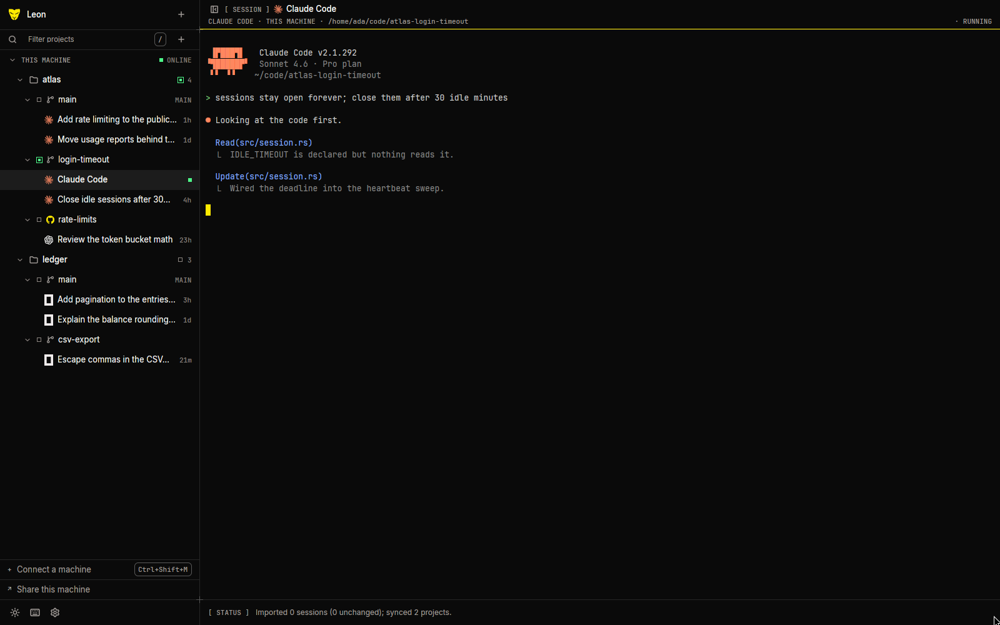 |
| _Every machine, project and worktree in one tree; live sessions above the history of their worktree._ | _A session started from the tree, in a real terminal, with the agent working in it._ |
| 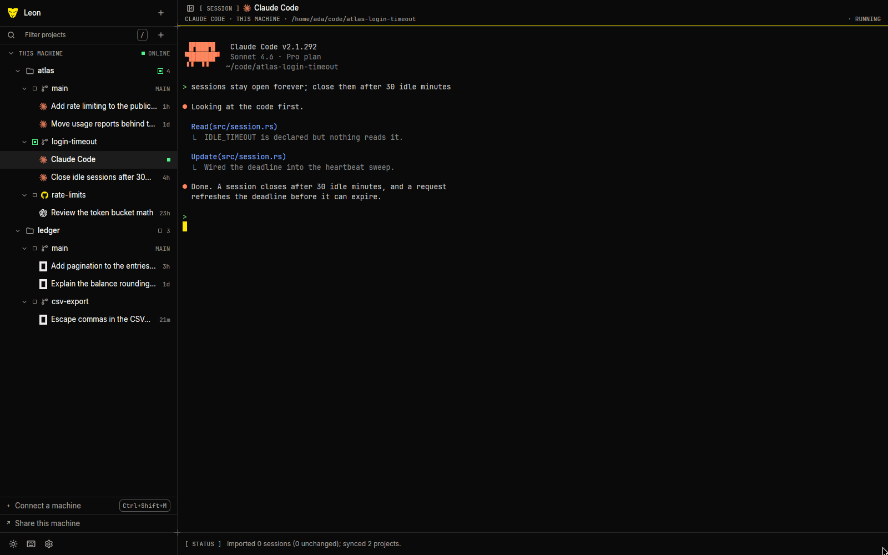 | 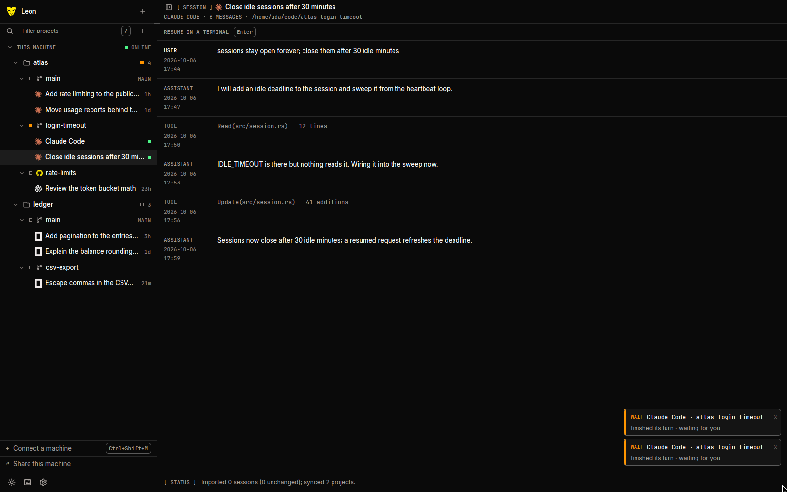 |
| _When the agent waits for you the sidebar says so; the session stays alive in the background._ | _`Ctrl+Shift+L` shows the stored transcript; `Enter` resumes it in a terminal._ |
| 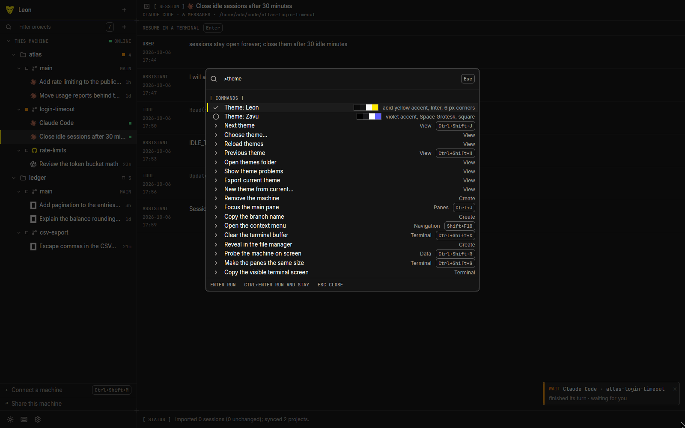 | 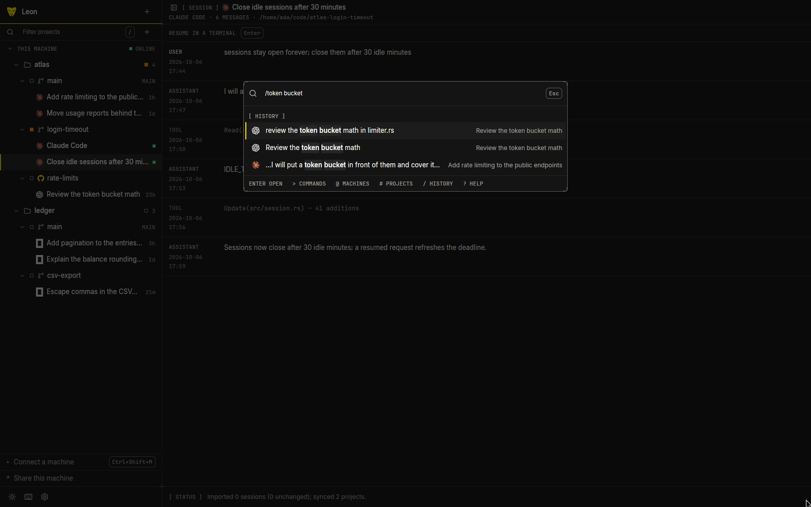 |
| _The command palette reaches every command, the themes included._ | _`Ctrl+Shift+I` searches the messages of every imported session._ |
| 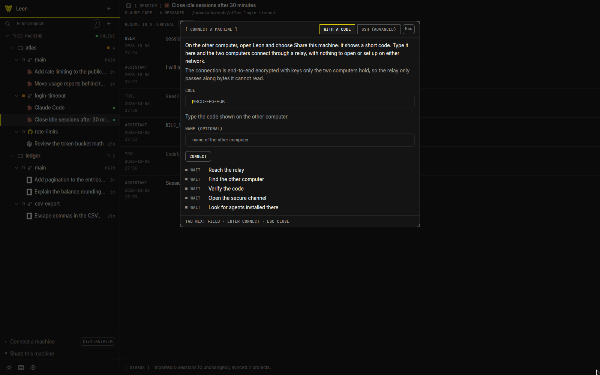 | 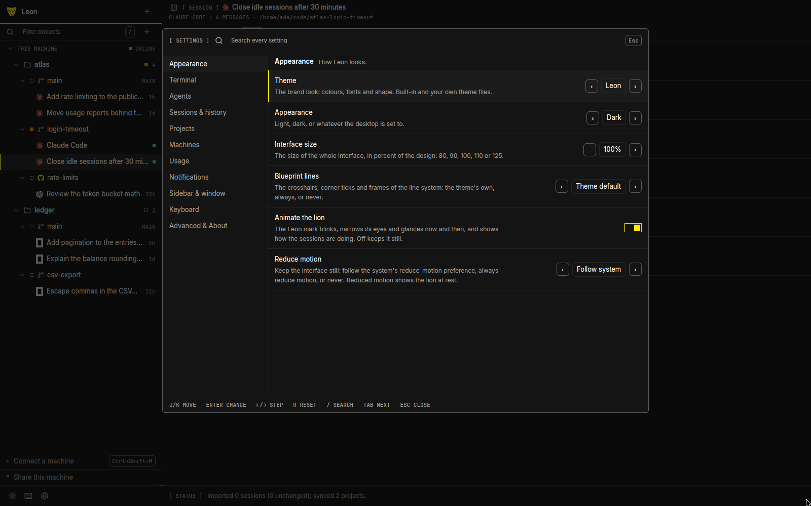 |
| _Connecting a machine: with a code, through the relay, or over SSH._ | _Settings, from the appearance to the agents._ |
| 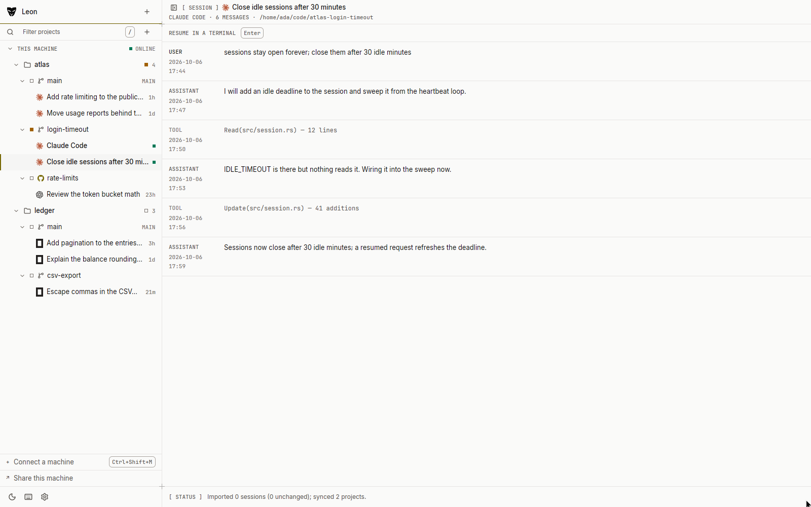 | 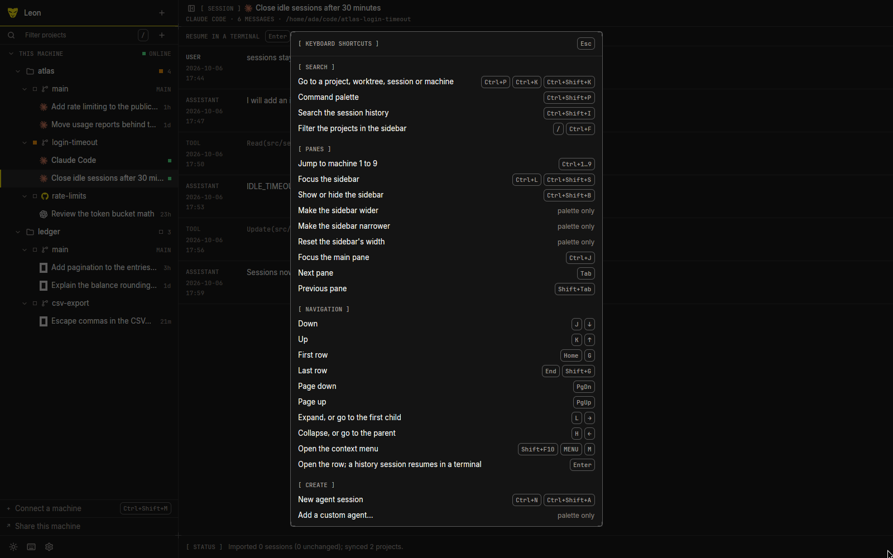 |
| _The same window in the light appearance._ | _`?` lists every shortcut, searchable._ |

### Clips

Four short recordings of the demo workspace; each plays inline and links to
the MP4 of the same recording.

| | |
| --- | --- |
| [](docs/media/video/hero.mp4) | [](docs/media/video/resume-a-session.mp4) |
| _Starting a session from the tree, and coming back to it while it runs._ | _Resuming a history session, and opening its stored transcript._ |
| [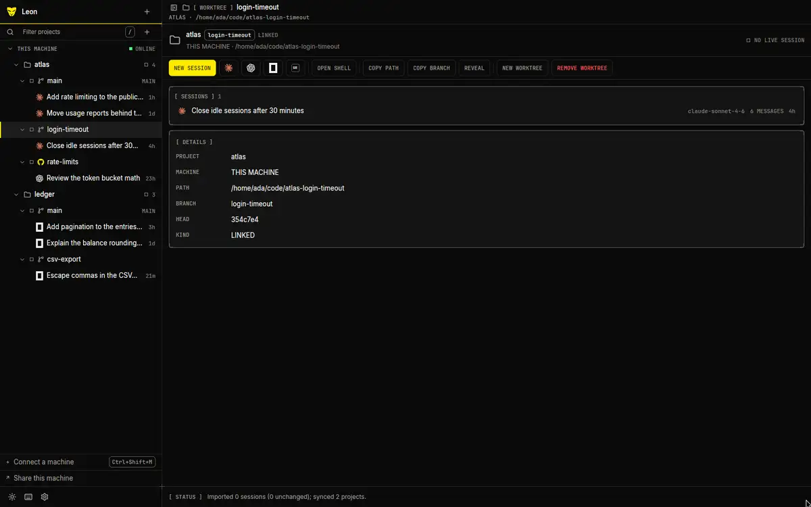](docs/media/video/panes-and-tabs.mp4) | [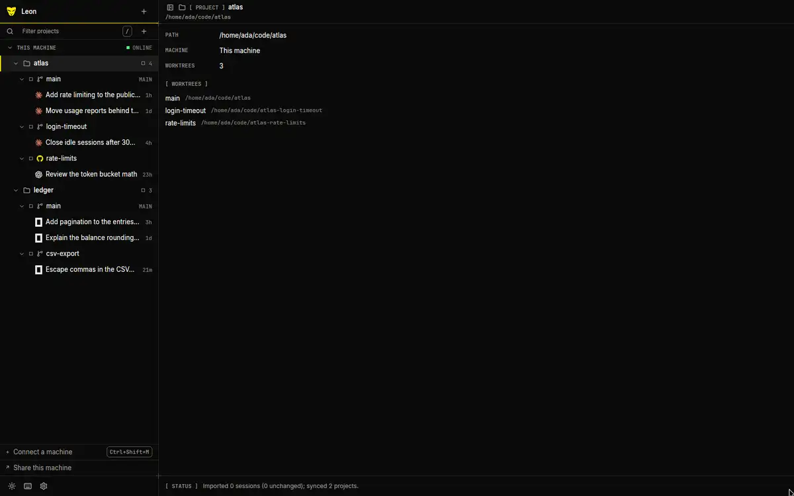](docs/media/video/themes.mp4) |
| _A shell, a command, a split, and moving between panes._ | _Light and dark, and the two built-in themes._ |

## Install

On Linux, install Leon completely for your user (binary, applications-menu
entry, icons and licences) with no root access:

```sh
curl -fsSL https://github.com/zavudev/leon/releases/latest/download/install.sh | sh
```

Run the command again to upgrade, or download the `.deb`/`.rpm` from the
[releases page](https://github.com/zavudev/leon/releases) for a system install.
The script verifies the archive against the release's SHA-256 checksums and
supports `--uninstall` without removing projects or settings. Leon's Linux build
requires x86_64 and glibc 2.35 or newer (Ubuntu 22.04 or a similarly recent
distribution).

Builds for macOS, Linux and Windows are on that releases page. Pick the file for
your computer (`<version>` is the release, for example `0.1.0`):

| Platform | File | To install |
| --- | --- | --- |
| macOS, Apple Silicon | `leon-<version>-macos-aarch64.dmg` | Open it and drag Leon to Applications. |
| macOS, Intel | `leon-<version>-macos-x86_64.dmg` | The same. |
| Linux, x86_64 | `install.sh`, `leon_<version>_amd64.deb`, or `leon-<version>-1.x86_64.rpm` | Use the command above for a user install, or install the package for the whole system. The tarball remains available for manual installs. |
| Windows, x86_64 | `leon-<version>-windows-x86_64.zip` | There is no installer: unzip it and run `leon.exe` from a folder you own. |

`SHA256SUMS` in the release lists the checksum of every file
(`sha256sum -c SHA256SUMS`, or `shasum -a 256 -c SHA256SUMS` on macOS).

**Unsigned builds.** Until the maintainers' signing certificates are configured
(see [docs/RELEASING.md](docs/RELEASING.md)), the macOS and Windows builds are not
signed:

* macOS: Gatekeeper says the app "cannot be opened". Open it once with a
  right-click on Leon in Applications, `Open`, and confirm; or allow it in System
  Settings, Privacy & Security, `Open Anyway`; or run
  `xattr -dr com.apple.quarantine /Applications/Leon.app`.
* Windows: SmartScreen warns about an unknown publisher: `More info`, `Run anyway`.

Leon updates itself from these same releases and from nowhere else: see
[Updates](#updates). The Linux and Windows builds have not been tried by a human
yet (see the [changelog](CHANGELOG.md)); please report what you find.

The agents themselves are not part of Leon: install the ones you use (`claude`,
`codex`, `opencode`, or any of the [agents Leon knows](#agents)) on every machine
you want to run them on.

## Build

Leon is a Rust workspace (stable toolchain, Rust 1.85 or newer) with a GPUI
interface.

| OS | Prerequisites |
| --- | --- |
| macOS | Xcode command line tools (`xcode-select --install`) and the Metal toolchain that comes with Xcode |
| Linux | A C toolchain and the development files for Wayland and X11, XKB and fontconfig: on Debian or Ubuntu `sudo apt install build-essential pkg-config libfontconfig1-dev libwayland-dev libxkbcommon-dev libxkbcommon-x11-dev libxcb1-dev libx11-xcb-dev`, the packages CI installs; a GPU driver with Vulkan to run it. Adjust to the error your first build reports |
| Windows | Visual Studio Build Tools with the C++ workload and the Windows SDK. Terminals use ConPTY (Windows 10 1809 or newer). Remote hosts must have a POSIX shell. |

```sh
cargo build --release -p leon      # target/release/leon
cargo run -p leon                  # run from source
scripts/run-macos.sh               # macOS: build, wrap in Leon.app and open it
cargo run -p leon -- --data-dir /tmp/leon-try --theme dark --theme-name zavu
```

Options: `--data-dir <path>` keeps the database and settings elsewhere,
`--theme <light|dark|system>` overrides the saved appearance for one run,
`--theme-name <id>` overrides the saved theme (`leon` or `zavu`) for one run
(see [Themes](#themes)), and `--den` opens on [The Den](docs/DEN.md). A
development build also reads `LEON_DEN_CAST=<count>`: that many made-up lions
in the Den, to look at a full one without starting a dozen agents.

The agents themselves are not part of Leon: install the ones you use
(`claude`, `codex`, `opencode`) on every machine you want to run them on.
Leon checks before it starts one: this computer is searched for it, an SSH
machine's probe says whether it has it, and an agent that is not installed
ends in a clear message. The agent is then started by the shell, so the
shell's own `PATH` decides which one runs.

### The application icon

The icon is the glare mark on its ink tile, generated from
`crates/app/assets/brand/app-icon.svg` by `scripts/generate-icons.sh` (needs
`rsvg-convert` and `python3`, plus `iconutil` on macOS); do not edit the PNGs.

* **macOS**: `cargo build --release -p leon` and then
  `packaging/macos/bundle.sh target/release/leon 0.1.0 dist` write
  `dist/Leon.app` (bundle id `dev.zavu.leon`, not signed; the executable
  inside is `Contents/MacOS/Leon`).
  *Why a bundle in development:* macOS takes the Dock label, the name and icon
  in Activity Monitor and the application-menu title from the application
  bundle, or from the executable's file name (`leon`) when there is none, and
  setting the process name in code does not change them. So `.cargo/config.toml`
  gives the macOS targets a runner, `scripts/cargo-runner-macos.sh`: for the
  `leon` binary, `cargo run -p leon` first makes or refreshes
  `target/<profile>/Leon.app` (a development bundle, marked
  `LeonDevelopmentBuild`; the executable is a hard link to the built binary)
  and then `exec`s `Leon.app/Contents/MacOS/Leon` with your arguments, so output,
  exit status and Ctrl+C are the same as before. Test binaries, examples and
  other tools run as they are, and so do `--help`, `--version` and `--diagnose`,
  which open no window. Linux, Windows and CI are untouched. A `target/debug/leon`
  started by hand is unbundled: it still gets the mark in the Dock, but the
  system calls it `leon`. `scripts/run-macos.sh` builds the packaged layout in
  `dist/` and opens it.
* **Windows**: the icon is embedded in the executable by `build.rs`
  (`winresource`) when you build on Windows.
* **Linux**: install `crates/app/assets/linux/dev.zavu.leon.desktop` to
  `~/.local/share/applications/` and
  `crates/app/assets/icons/app-icon-<size>.png` to
  `~/.local/share/icons/hicolor/<size>x<size>/apps/dev.zavu.leon.png`
  (sizes 16 to 512), with the `leon` binary on the `PATH`. Wayland takes the
  window's icon from that entry, which is named after the application id.

## Run

1. `Open project…` on this computer (`Cmd+O` or `Ctrl+O`) opens the system's
   own folder dialog. For an SSH machine (`Connect a machine…` first, see below)
   there is no dialog to show, so you pick one of the repositories Leon found
   there or type the path. Two more ways to start a project, both offered on
   this computer and on a machine: `Clone a repository…` clones a git URL
   (HTTPS or SSH; the name and folder are offered from the URL, exactly as
   `git clone` would name them) and `New project…` creates a brand-new
   repository (empty, with one initial commit, so worktrees have a branch to
   hang from) in a folder you pick with the dialog or type. Cloning or
   creating on a machine runs `git` there through the same SSH runner as
   everything else; an existing folder is only used when it is empty.
2. Select a worktree and start a session: `New agent session`, choose the
   agent. Without a selected worktree it asks for one first.
3. `Open a shell here` opens a terminal in the selected worktree.

Every terminal is your machine's interactive login shell (`$SHELL -l -i`,
PowerShell on Windows, `ssh -t` into the remote login shell) in the folder; an
agent is started by typing its command line into that shell. When the agent
exits or you quit it, the terminal stays at the shell prompt in that folder:
a pane only closes when its shell exits or you close it. On this computer
Leon can tell whether a program is running in front of the shell, so it
labels a terminal with the agent while one is, and asks before closing a
pane with a program running in it; over SSH it cannot tell, and it says
nothing it does not know.
4. `Enter` (or a click) on a history session **asks first** (`Resume` or
   `Cancel`, the first answer resumes), and then **opens it in a terminal that
   resumes it**: the base shell of that session's machine in that session's
   folder, then `claude --resume <id>` (`codex resume <id>`,
   `opencode --session <id>`) typed into it. The terminal belongs to the
   workspace of the worktree the session hangs under, as a new tab if that
   workspace already has panes (a session of no project gets a workspace of
   its folder), and has the keyboard. Open the same session again and you land
   on the terminal that already runs it; close that terminal and the next open
   resumes it again. An agent that moves to another session inside one
   terminal (opencode's session list, for one) is followed by the title it
   puts on the terminal: the session on screen becomes that terminal's row,
   and opening it lands on the terminal already showing it, never on a second
   process of the same session.
   `Open transcript` (`⇧⌘L` / `Ctrl+Shift+L`, also from the terminal that
   resumed it, and in the menu and palette) shows the stored messages
   read-only and starts nothing; `Enter` in that view resumes. A search hit on
   a message in the history search opens the transcript at that message; the
   session itself, found by its title, is resumed.
   When the session cannot be resumed (its folder is gone, the machine does
   not answer, the agent is not installed there) nothing broken is opened:
   the transcript is shown with the reason in the status line and at its top.
   For a folder that is gone it offers `Resume in…`, a choice among the other
   worktrees of the same project. A remote folder is checked in the
   background, through the same SSH runner as everything else.
   **Sessions running in another terminal.** Leon looks for agent processes
   it did not start (iTerm, Terminal, tmux, another Leon) and ties each to a
   history session: a session id in the process's arguments, or, for Claude
   Code, its own `~/.claude/sessions/<pid>.json`, is a certain match; for a bare
   `claude`, `codex` or `opencode` the best fit in the process's folder is
   marked as likely. Such a session keeps the agent's colour and wears a violet
   mark and a badge in the tree: `ELSEWHERE` when a plain terminal runs it
   ("Running in another terminal · pid 70645"), `OTHER LEON` when a `leon` (or,
   over SSH, `leon-host`) process is above it ("Running in another Leon on
   <machine>"). It is not counted as a live session of Leon and a click (or
   `Enter`) never resumes it: it asks "Running in another terminal. Resume
   anyway?" with `Open transcript` (the default), `Take over`, `Resume anyway` and `Cancel`.
   The transcript shows a notice and the choices `Open transcript`, `Resume here anyway…` (asks first,
   because two processes on one session can corrupt its history) and, on macOS
   when the process tree names the terminal application, `Reveal`. For a
   likely match `Enter` on the notice resumes. **Take over** asks the process
   that holds the session to end (SIGTERM, never forced), waits up to five
   seconds for it to be gone, and only then resumes the session in Leon; if it
   does not end, nothing is resumed and Leon says so. It only exists on this
   computer (a process on another machine cannot be signalled from here) and not
   on Windows. The check runs every few
   seconds while the window is focused, when it regains focus, on `Refresh`
   (over SSH too, as one more command on the shared connection) and just
   before a session is opened. `leon --diagnose sessions-elsewhere` runs it
   once and prints what it found.

Leave a terminal for the tree with `Cmd+L` on macOS (`Ctrl+Shift+S` elsewhere:
`Focus the sidebar`, which opens the sidebar first if it is hidden);
`Focus the terminal` comes back. `Cmd+B` (`Ctrl+Shift+B`) shows or hides the
sidebar.

## Connecting a machine

A machine is another computer (a server, a desktop at the office, a spare
laptop) whose projects, worktrees and agent sessions you drive from Leon.
There are two ways to connect, and **With a code** is the default.

* **With a code (recommended).** Install Leon on the other computer, choose
  **Share this machine** (File menu, palette, Settings ▸ Machines, or the foot of
  the sidebar) and it shows a short code. On your computer choose **Connect a
  machine ▸ With a code** and type it. Both computers dial out to a relay
  server operated by Zavu, which pairs them and passes bytes along: no open
  ports, no SSH setup, and it works behind NAT. The connection is end-to-end
  encrypted with keys only your two computers hold, so the relay cannot read it.
  Terminals keep running on the shared computer when you close the window and
  can be re-attached. See [docs/REMOTE.md](docs/REMOTE.md) for the threat
  model and the protocol. **The relay service is not live yet**: until it is,
  Leon says exactly that, with the address it tried, instead of hanging.
* **SSH (advanced).** Leon reaches the computer with your system's SSH, signing
  in as you; Leon installs nothing on the other computer. The rest of this
  section describes this method.

Sharing runs as you: a paired computer gets a terminal as you on the shared
one. Pair only your own devices. `leon host` runs the sharing service without a
window (`leon host --pair`, `leon host pair`, `leon host devices`,
`leon host revoke <device>`, `leon host status`); it refuses to run as root.

To keep a computer shared without leaving a window or a terminal open, install
the host as a **background service** of your own session:
`leon host service install` (a systemd user unit on Linux, a launchd agent on
macOS; Windows is not supported yet), then `leon host service status` (installed,
running, since when, how many devices are paired), `leon host service logs` and
`leon host service uninstall`, which leaves your pairings and settings alone. On
Linux the service starts at login and stops when you log out of your last
session; `leon host service install --linger` also turns on systemd's lingering
(`loginctl enable-linger`, no root needed) so it starts at boot and stays up. The
service never needs root, restarts after a failure (with a growing delay under
systemd 254 or newer) and runs the file that installed it, so an update that
replaces that file in place is picked up the next time the service starts; with
Homebrew or Nix, which keep each version in its own folder, run `install` again
after an update. `install` waits a moment and exits with an error if the host
did not stay up, and `uninstall` keeps the definition and says so if it could
not stop the service. Do not run it together with **Share this machine** in the
app on the same computer. It keeps the host's terminals running, not Leon's
window: the sessions you open on this computer in the app still end with the
window.

Open the **Connect a machine** screen with `Cmd+Shift+M` (`Ctrl+Shift+M`), File
▸ Connect a machine…, the command palette (`remote`, `server`, `code` and
`connect` find it), Settings ▸ Machines, or the `Connect a machine` row at the
foot of the sidebar; **SSH (advanced)** in its header switches to the SSH
screen. Editing an SSH machine opens that screen, filled in. `Esc` closes it and
gives the keyboard back to where it was.

Three things must be true on the other computer. The screen explains each in a
"How do I…?" row, for the platform you pick (macOS, Linux; Windows is not
supported yet):

1. **SSH is switched on.** macOS: System Settings ▸ General ▸ Sharing ▸ Remote
   Login. Linux: `sudo apt install openssh-server`, then
   `sudo systemctl enable --now ssh` (`sshd` on Fedora and Arch).
2. **Your key is allowed in.** Leon runs SSH without a terminal, so it cannot
   type a password: key login must already work. The screen shows which public
   keys exist in `~/.ssh` (their names only, never their contents), how to make
   one (`ssh-keygen -t ed25519`) and the exact `ssh-copy-id user@host` line for
   what you typed, with a copy button (`Cmd+Shift+C`).
3. **An agent is installed there**: Claude Code (`claude`), Codex (`codex`) or
   opencode (`opencode`).

The form takes a name, the host (`user@host`, `user@host:port`,
`ssh://user@host:port` or a bare host; it is split into the User and Port
fields as you type), the user (your own login name by default), the port
(22), an optional identity file (a file dialog, or the keys found in
`~/.ssh`) and an optional start folder, where the search for projects begins.
Hosts from `~/.ssh/config` and `known_hosts` are offered as suggestions (names
only; hashed entries and key material are never read into the screen). Under the
form is the exact `ssh` command Leon will run, with a copy button, so you can try
it in a terminal.

**Test connection** (`Cmd+Enter`, and automatically before saving) shows a
checklist, each line going from pending to pass or fail, with what it means and
the fix:

| Line | What it checks | When it fails |
| --- | --- | --- |
| Reach the computer | the name resolves and the SSH port answers | unknown name, refused, timed out, no route: check the address, that it is on, that SSH is enabled, the firewall |
| Recognise its host key | `known_hosts` knows it and it is unchanged | unknown: its fingerprint is shown and `Trust this computer` adds it to `known_hosts` after a confirmation. Changed: Leon explains the risk and offers no override |
| Sign in with your key | the key is accepted without a prompt | key refused (`ssh-copy-id` line and the key tried), password-only server, passphrase key not in the agent (`ssh-add`), too many keys, bad key file permissions, missing identity file |
| Run commands there | a POSIX shell answers | Windows: not supported yet |
| Git is installed | `git` is found | a note with how to install it |
| Agents are installed | which of `claude`, `codex`, `opencode`, with their paths | a note with an install pointer for each missing one |

The raw `ssh` output is under `Details`. `Escape` or `Cancel` stops a test, and
the `ssh` it started is killed. If the test fails you can still `Save anyway`.

After saving, the machine is in the tree, selected, and the screen offers
`Add a project on this machine` (the git repositories found near its home or
start folder, a few levels deep, are offered as folders), `Open a shell` and
`Done`. When a machine is later `OFFLINE`, selecting it (or `Why is it offline?`
in its context menu) shows the same checklist for its last failure, with
`Test again`.

`leon --diagnose connect user@host[:port]` runs the same checklist from the
command line and prints each line with its diagnosis, so a host can be tested
without the window. It only attempts an SSH connection in batch mode.

Limits: remote history is not imported yet (only sessions started from Leon on
that machine are known), pasting an image works for local terminals only, and a
remote Windows machine is not supported.

## Shortcuts

One registry (`crates/app/src/keys.rs`) defines every shortcut; the palette,
the shortcuts sheet (`?`), the context menu's chips and this table read it
(a test fails if this table lacks one). `Cmd` on macOS is `Ctrl` on Linux and
Windows where a command is written `secondary`; pane chords are different per
platform (see below).

| Command | macOS | Linux and Windows |
| --- | --- | --- |
| **Search** | | |
| Go to a project, worktree, session or machine | `⌘P` `⌘K` `⇧⌘K` | `Ctrl+P` `Ctrl+K` `Ctrl+Shift+K` |
| Command palette | `⇧⌘P` | `Ctrl+Shift+P` |
| Search the session history | `⇧⌘F` | `Ctrl+Shift+I` |
| Filter the projects in the sidebar | `/` `⌘F` | `/` `Ctrl+F` |
| **Panes** | | |
| Jump to machine 1 to 9 | `⌘1` | `Ctrl+1` |
| Focus the sidebar | `⌘L` `⇧⌘B` | `Ctrl+L` `Ctrl+Shift+S` |
| Show or hide the sidebar | `⌘B` | `Ctrl+Shift+B` |
| Show or hide the file tree | `⇧⌘E` | `Ctrl+Shift+Alt+E` |
| Show inactive sessions | palette only | palette only |
| Make the sidebar wider | palette only | palette only |
| Make the sidebar narrower | palette only | palette only |
| Reset the sidebar's width | palette only | palette only |
| Focus the main pane | `⌘J` | `Ctrl+J` |
| Next pane | `⇥` | `Tab` |
| Previous pane | `⇧⇥` | `Shift+Tab` |
| **Navigation** | | |
| Down | `J` `↓` | `J` `↓` |
| Up | `K` `↑` | `K` `↑` |
| First row | `Home` `G` | `Home` `G` |
| Last row | `End` `⇧G` | `End` `Shift+G` |
| Page down | `PgDn` | `PgDn` |
| Page up | `PgUp` | `PgUp` |
| Expand, or go to the first child | `L` `→` | `L` `→` |
| Collapse, or go to the parent | `H` `←` | `H` `←` |
| Open the context menu | `⇧F10` `MENU` `M` | `Shift+F10` `MENU` `M` |
| Open the row; a history session resumes in a terminal | `↩` | `Enter` |
| **Create** | | |
| New agent session | `⌘N` `⇧⌘A` | `Ctrl+N` `Ctrl+Shift+A` |
| Add a custom agent… | palette only | palette only |
| Remove a custom agent… | palette only | palette only |
| Add an account… | palette only | palette only |
| Rename an account… | palette only | palette only |
| Remove an account… | palette only | palette only |
| Resume the session… (asks first) | palette only | palette only |
| Resume the session in another worktree… | palette only | palette only |
| Resume here anyway… (a session running in another terminal) | palette only | palette only |
| Take over the session running elsewhere… | palette only | palette only |
| Reveal the terminal it runs in | palette only | palette only |
| Open a shell here | `⌘T` `⇧⌘T` | `Ctrl+T` `Ctrl+Shift+T` |
| New worktree | `⇧⌘N` | `Ctrl+Shift+N` |
| Run a script… | palette only | palette only |
| One prompt, several agents… | palette only | palette only |
| Connect a machine… | `⇧⌘M` | `Ctrl+Shift+M` |
| Share this machine… | palette only | palette only |
| Open project… | `⌘O` | `Ctrl+O` |
| Clone a repository… | palette only | palette only |
| New project… | palette only | palette only |
| Add a remote project by path… | palette only | palette only |
| Remove a project | palette only | palette only |
| Remove a worktree | palette only | palette only |
| Remove merged worktrees… | palette only | palette only |
| Remove the machine | palette only | palette only |
| Edit a machine… | palette only | palette only |
| Why is it offline? | palette only | palette only |
| Rename | `F2` | `F2` |
| Move up | context menu | context menu |
| Move down | context menu | context menu |
| Pin the session | context menu | context menu |
| Unpin the session | context menu | context menu |
| Settle the session | palette only | palette only |
| Snooze the session… | palette only | palette only |
| Bring the session back | palette only | palette only |
| Undo the last close, sleep, settle, snooze or unpin | `⌥⌘Z` | `Ctrl+Shift+Alt+Z` |
| Copy the path | palette only | palette only |
| Refresh project icon | palette only | palette only |
| Choose project icon… | palette only | palette only |
| Reset project icon | palette only | palette only |
| Copy the branch name | palette only | palette only |
| Copy the session id | palette only | palette only |
| Reveal in the file manager | palette only | palette only |
| Open the transcript | `⇧⌘L` | `Ctrl+Shift+L` |
| Remove from history | palette only | palette only |
| **Files** | | |
| Find in the file… | `⌘F` | `Ctrl+F` |
| Replace in the file… | `⌥⌘F` | `Ctrl+H` |
| Open a file… | `⇧⌘O` | `Ctrl+Shift+Alt+O` |
| Save the file | `⌘S` | `Ctrl+S` |
| Close the file | palette only | palette only |
| Reveal the file in the file tree | palette only | palette only |
| Preview the Markdown file | `⌥⌘V` | `Ctrl+Shift+Alt+V` |
| Open a file of the project by name… | `⌥⌘P` | `Ctrl+Shift+Alt+P` |
| Search the text of the project… | `⌥⇧⌘F` | `Ctrl+Shift+Alt+F` |
| Show the changes of the worktree | `⌥⌘G` | `Ctrl+Shift+Alt+G` |
| Push the branch | palette only | palette only |
| Commit, push and open a pull request | palette only | palette only |
| **Terminal** | | |
| Find in the terminal… | `⌘F` | `Ctrl+Shift+F` |
| Find next | `⌘G` | `Ctrl+Shift+E` |
| Find previous | `⇧⌘G` | `Ctrl+Shift+U` |
| Clear the terminal buffer | `⌘K` | `Ctrl+Shift+X` |
| Clear the scrollback | `⌥⌘K` | `Ctrl+Shift+Z` |
| Select all of the terminal | `⌘A` | palette only |
| Save the terminal output to a file… | `⌘S` | palette only |
| Paste as text | palette only | palette only |
| Paste image (send Ctrl+V) | palette only | palette only |
| Save the terminal output with colours… | palette only | palette only |
| Copy all terminal output | palette only | palette only |
| Copy the visible terminal screen | palette only | palette only |
| Focus the terminal | `⌘E` | `Ctrl+E` |
| Split the pane to the right | `⌘D` | `Ctrl+Shift+D` |
| Split the pane downwards | `⇧⌘D` | `Ctrl+Shift+O` |
| Focus the pane on the left | `⌥⌘←` | `Ctrl+Shift+←` |
| Focus the pane on the right | `⌥⌘→` | `Ctrl+Shift+→` |
| Focus the pane above | `⌥⌘↑` | `Ctrl+Shift+↑` |
| Focus the pane below | `⌥⌘↓` | `Ctrl+Shift+↓` |
| Focus the next pane | `⌘]` | `Ctrl+Shift+]` |
| Focus the previous pane | `⌘[` | `Ctrl+Shift+[` |
| Move the pane's divider left | `⌃⌘←` | `Ctrl+Shift+Alt+←` |
| Move the pane's divider right | `⌃⌘→` | `Ctrl+Shift+Alt+→` |
| Move the pane's divider up | `⌃⌘↑` | `Ctrl+Shift+Alt+↑` |
| Move the pane's divider down | `⌃⌘↓` | `Ctrl+Shift+Alt+↓` |
| Make the panes the same size | `⌃⌘=` | `Ctrl+Shift+G` |
| Maximise or restore the pane | `⇧⌘↩` | `Ctrl+Shift+Enter` |
| Next terminal tab | `⇧⌘]` | `Ctrl+Shift+PgDn` |
| Previous terminal tab | `⇧⌘[` | `Ctrl+Shift+PgUp` |
| Go to terminal tab 1 | `⌥⌘1` | `Ctrl+Shift+1` |
| Go to terminal tab 2 | `⌥⌘2` | `Ctrl+Shift+2` |
| Go to terminal tab 3 | `⌥⌘3` | `Ctrl+Shift+3` |
| Go to terminal tab 4 | `⌥⌘4` | `Ctrl+Shift+4` |
| Go to terminal tab 5 | `⌥⌘5` | `Ctrl+Shift+5` |
| Go to terminal tab 6 | `⌥⌘6` | `Ctrl+Shift+6` |
| Go to terminal tab 7 | `⌥⌘7` | `Ctrl+Shift+7` |
| Go to terminal tab 8 | `⌥⌘8` | `Ctrl+Shift+8` |
| Go to terminal tab 9 | `⌥⌘9` | `Ctrl+Shift+9` |
| Close the pane | `⌘W` | `Ctrl+Shift+W` |
| Sleep the pane | palette only | palette only |
| Copy the selection | `⌘C` `⇧⌘C` | `Ctrl+C` `Ctrl+Shift+C` |
| Paste | `⌘V` `⇧⌘V` `⇧Insert` | `Ctrl+V` `Ctrl+Shift+V` `Shift+Insert` |
| Scroll the terminal back a page | `⇧PgUp` | `Shift+PgUp` |
| Scroll the terminal forward a page | `⇧PgDn` | `Shift+PgDn` |
| **Data** | | |
| Import history and sync worktrees | `⌘R` | `Ctrl+R` |
| Probe the machine on screen | `⇧⌘R` | `Ctrl+Shift+R` |
| Why is a session missing? | palette only | palette only |
| Restore last sessions | palette only | palette only |
| **View** | | |
| Toggle light and dark | `⇧⌘Y` | `Ctrl+Shift+Y` |
| Choose appearance… | palette only | palette only |
| Choose theme… | palette only | palette only |
| Next theme | `⇧⌘J` | `Ctrl+Shift+J` |
| Previous theme | `⇧⌘H` | `Ctrl+Shift+H` |
| New theme from current… | palette only | palette only |
| Export current theme | palette only | palette only |
| Open themes folder | palette only | palette only |
| Reload themes | palette only | palette only |
| Show theme problems | palette only | palette only |
| Choose the interface size | palette only | palette only |
| Settings | `⌘,` | `Ctrl+,` |
| Show usage | `⇧⌘U` | `Ctrl+Shift+Alt+U` |
| Refresh usage now | palette only | palette only |
| Go home | `⌥⇧⌘H` | `Ctrl+Shift+Alt+H` |
| Open the Den | `⌥⇧⌘L` | `Ctrl+Shift+Alt+L` |
| Edit the Den | palette only (`E` in the Den) | palette only (`E` in the Den) |
| Message the selected lion… | palette only (`I` in the Den) | palette only (`I` in the Den) |
| Send the selected lion home… | palette only (`H` in the Den) | palette only (`H` in the Den) |
| Go to the next lion that needs you | palette only (`N` in the Den) | palette only (`N` in the Den) |
| Interrupt the selected lion | palette only (`X` in the Den) | palette only (`X` in the Den) |
| Message the pride… | palette only (`P` in the Den) | palette only (`P` in the Den) |
| Queued messages of the selected lion… | palette only (`Q` in the Den) | palette only (`Q` in the Den) |
| Hatch a lion… | palette only (`A` in the Den) | palette only (`A` in the Den) |
| Wake a lion that is at home… | palette only (`W` in the Den) | palette only (`W` in the Den) |
| Go to a lion… | palette only (`/` in the Den) | palette only (`/` in the Den) |
| Show the keys of the Den | palette only (`?` in the Den) | palette only (`?` in the Den) |
| Choose a den… | palette only | palette only |
| Save the den as… | palette only | palette only |
| Rename the den… | palette only | palette only |
| Delete the den… | palette only | palette only |
| Open dens folder | palette only | palette only |
| Open settings.json | palette only | palette only |
| Reveal settings folder | palette only | palette only |
| Larger interface | `⌘=` `⌘+` | `Ctrl+=` `Ctrl++` |
| Smaller interface | `⌘-` | `Ctrl+-` |
| Actual interface size | `⌘0` | `Ctrl+0` |
| **Application** | | |
| Keyboard shortcuts | `?` | `?` |
| Quit Leon | `⌘Q` | `Ctrl+Shift+Q` |
| Close the window | `⇧⌘W` | palette only |
| About Leon | palette only | palette only |
| Check for updates… | palette only | palette only |
| Restart to update | palette only | palette only |
| Show release notes | palette only | palette only |
| Skip this version | palette only | palette only |
| Open the download page | palette only | palette only |
| Close, or go back | `Esc` | `Esc` |

### While a terminal has the keyboard

A terminal program must receive its keys, so most of Leon's chords step aside
while one has the keyboard. `Ctrl+D`, `Esc`, `Tab` and the arrows always reach
the program; `Ctrl+C` does too unless there is a selection to copy.

* **macOS**: every `Cmd` chord of the table stays Leon's (no terminal program
  uses `Cmd`; this includes the `Ctrl+Cmd` chords that resize panes), and
  `Cmd+C` and `Cmd+V` copy and paste. A `Ctrl` chord on its own always goes
  to the program.
* **Linux and Windows**: `Ctrl+C` copies the selection when there is one and
  goes to the program when there is not, so a running command is still
  interrupted; `Ctrl+Shift+C` always copies. `Ctrl+V` pastes; the `Ctrl+Shift`
  aliases continue to work. Other Leon chords must also hold `Shift`, because
  a terminal cannot tell `Ctrl+Shift+X` from `Ctrl+X` and so no program uses
  it; `Shift+Insert`, `Shift+PgUp` and `Shift+PgDn` work too. `Ctrl+P`,
  `Ctrl+N`, `Ctrl+W`, `Ctrl+D`, `Ctrl+1` and so on go to the program.
* Bare keys are never Leon's in a terminal.

The chords that stay Leon's, in full:

macOS:

* Go to a project, worktree, session or machine `⌘P`
* Go to a project, worktree, session or machine `⌘K`
* Go to a project, worktree, session or machine `⇧⌘K`
* Command palette `⇧⌘P`
* Search the session history `⇧⌘F`
* Jump to machine 1 `⌘1`
* Jump to machine 2 `⌘2`
* Jump to machine 3 `⌘3`
* Jump to machine 4 `⌘4`
* Jump to machine 5 `⌘5`
* Jump to machine 6 `⌘6`
* Jump to machine 7 `⌘7`
* Jump to machine 8 `⌘8`
* Jump to machine 9 `⌘9`
* Focus the sidebar `⌘B`
* Focus the sidebar `⌘L`
* Focus the sidebar `⇧⌘B`
* Show or hide the file tree `⇧⌘E`
* Focus the main pane `⌘J`
* New agent session `⌘N`
* New agent session `⇧⌘A`
* Open a shell here `⌘T`
* Open a shell here `⇧⌘T`
* New worktree `⇧⌘N`
* Connect a machine… `⇧⌘M`
* Share this machine… palette only
* Open project… `⌘O`
* Open the transcript `⇧⌘L`
* Open a file… `⇧⌘O`
* Save the file `⌘S`
* Open a file of the project by name… `⌥⌘P`
* Search the text of the project… `⌥⇧⌘F`
* Show the changes of the worktree `⌥⌘G`
* Focus the terminal `⌘E`
* Split the pane to the right `⌘D`
* Split the pane downwards `⇧⌘D`
* Focus the pane on the left `⌥⌘←`
* Focus the pane on the right `⌥⌘→`
* Focus the pane above `⌥⌘↑`
* Focus the pane below `⌥⌘↓`
* Focus the next pane `⌘]`
* Focus the previous pane `⌘[`
* Move the pane's divider left `⌃⌘←`
* Move the pane's divider right `⌃⌘→`
* Move the pane's divider up `⌃⌘↑`
* Move the pane's divider down `⌃⌘↓`
* Make the panes the same size `⌃⌘=`
* Maximise or restore the pane `⇧⌘↩`
* Next terminal tab `⇧⌘]`
* Previous terminal tab `⇧⌘[`
* Go to terminal tab 1 `⌥⌘1`
* Go to terminal tab 2 `⌥⌘2`
* Go to terminal tab 3 `⌥⌘3`
* Go to terminal tab 4 `⌥⌘4`
* Go to terminal tab 5 `⌥⌘5`
* Go to terminal tab 6 `⌥⌘6`
* Go to terminal tab 7 `⌥⌘7`
* Go to terminal tab 8 `⌥⌘8`
* Go to terminal tab 9 `⌥⌘9`
* Close the pane `⌘W`
* Copy the selection `⌘C`
* Copy the selection `⇧⌘C`
* Paste `⌘V`
* Paste `⇧⌘V`
* Paste `⇧Insert`
* Scroll the terminal back a page `⇧PgUp`
* Scroll the terminal forward a page `⇧PgDn`
* Import history and sync worktrees `⌘R`
* Probe the machine on screen `⇧⌘R`
* Toggle light and dark `⇧⌘Y`
* Next theme `⇧⌘J`
* Previous theme `⇧⌘H`
* Settings `⌘,`
* Larger interface `⌘=`
* Larger interface `⌘+`
* Smaller interface `⌘-`
* Actual interface size `⌘0`

Linux and Windows:

* Go to a project, worktree, session or machine `Ctrl+Shift+K`
* Command palette `Ctrl+Shift+P`
* Search the session history `Ctrl+Shift+F`
* Focus the sidebar `Ctrl+Shift+B`
* Show or hide the file tree `Ctrl+Shift+Alt+E`
* New agent session `Ctrl+Shift+A`
* Open a shell here `Ctrl+Shift+T`
* New worktree `Ctrl+Shift+N`
* Connect a machine… `Ctrl+Shift+M`
* Share this machine… palette only
* Open the transcript `Ctrl+Shift+L`
* Open a file… `Ctrl+Shift+Alt+O`
* Open a file of the project by name… `Ctrl+Shift+Alt+P`
* Search the text of the project… `Ctrl+Shift+Alt+F`
* Show the changes of the worktree `Ctrl+Shift+Alt+G`
* Split the pane to the right `Ctrl+Shift+D`
* Split the pane downwards `Ctrl+Shift+O`
* Focus the pane on the left `Ctrl+Shift+←`
* Focus the pane on the right `Ctrl+Shift+→`
* Focus the pane above `Ctrl+Shift+↑`
* Focus the pane below `Ctrl+Shift+↓`
* Focus the next pane `Ctrl+Shift+]`
* Focus the previous pane `Ctrl+Shift+[`
* Move the pane's divider left `Ctrl+Shift+Alt+←`
* Move the pane's divider right `Ctrl+Shift+Alt+→`
* Move the pane's divider up `Ctrl+Shift+Alt+↑`
* Move the pane's divider down `Ctrl+Shift+Alt+↓`
* Make the panes the same size `Ctrl+Shift+G`
* Maximise or restore the pane `Ctrl+Shift+Enter`
* Next terminal tab `Ctrl+Shift+PgDn`
* Previous terminal tab `Ctrl+Shift+PgUp`
* Go to terminal tab 1 `Ctrl+Shift+1`
* Go to terminal tab 2 `Ctrl+Shift+2`
* Go to terminal tab 3 `Ctrl+Shift+3`
* Go to terminal tab 4 `Ctrl+Shift+4`
* Go to terminal tab 5 `Ctrl+Shift+5`
* Go to terminal tab 6 `Ctrl+Shift+6`
* Go to terminal tab 7 `Ctrl+Shift+7`
* Go to terminal tab 8 `Ctrl+Shift+8`
* Go to terminal tab 9 `Ctrl+Shift+9`
* Close the pane `Ctrl+Shift+W`
* Copy the selection `Ctrl+C` (the key is the program's when there is none)
* Copy the selection `Ctrl+Shift+C`
* Paste `Ctrl+V`
* Paste `Ctrl+Shift+V`
* Paste `Shift+Insert`
* Scroll the terminal back a page `Shift+PgUp`
* Scroll the terminal forward a page `Shift+PgDn`
* Probe the machine on screen `Ctrl+Shift+R`
* Toggle light and dark `Ctrl+Shift+Y`
* Next theme `Ctrl+Shift+J`
* Previous theme `Ctrl+Shift+H`

### Files

`Open a file…` asks for a path (relative to the folder you are in, or
absolute) and opens it in a tab beside the terminals of its project, on this
computer or on any machine you connected. It is a code editor: highlighting for
the common languages, line numbers, undo, tabs. `Save the file` writes it;
closing, or quitting, with unsaved changes asks first (quitting offers to save
them all), and a file somebody else changed meanwhile is never overwritten
without asking. A file is a pane like a terminal: split, focus and close work
the same.

Unsaved text is also kept in a draft beside the settings, so a crash or a power
cut loses nothing: open the file again and the text is back as unsaved changes
(if the file changed on disk meanwhile, saving asks what to do). When the
window comes to the front, a file that changed on disk is read again if you had
not touched it; if you had, a banner above the editor offers `Reload` or `Keep
mine`. The files that were open (with the cursor and the Markdown view) are
opened again at the next start, and the file tree is as you left it; a file
that is gone is skipped. A file that is not text, or is over 2 MiB, can be
shown read only with `Open anyway` when it is on this computer. `Reveal the
file in the file tree` selects the file that has the keyboard in the tree.

A Markdown file (`.md`, `.markdown`) has a preview: `Preview the Markdown file`
(`Cmd+Opt+V`, `Ctrl+Shift+Alt+V`, or the buttons above the file) goes from the
text to text and page side by side to the page alone. The page follows the text
as you type, shows tables, task lists and highlighted code blocks, opens web
links in the browser and links to other files in a tab (on the same machine as
the document), and shows relative images when the document is on this computer
(on another machine their description is shown).

The Editor section of the settings has the tab size, wrapping, line numbers,
indent guides, syntax highlighting, font size (the family is the terminal's) and
whether files are reopened at start; they apply to the files that are open.

`Find in the file…` (`Cmd+F`, `Ctrl+F`) opens the editor's search bar and
`Replace in the file…` (`Cmd+Opt+F`, `Ctrl+H`) the same with the replacement
field; both apply only while a file has the keyboard (in a terminal `Cmd+F` /
`Ctrl+Shift+F` is still the terminal's own find, and in the sidebar `Cmd+F`
still filters the projects). `Esc` closes the bar. The bar has the case
switch, `Enter` / `Shift+Enter` for the next and the previous match, and
replace one or all.

`Open a file of the project by name…` (`Cmd+Opt+P`, `Ctrl+Shift+Alt+P`; or
type `~` in the palette) lists the files of the project in view, the ones git
tracks and has not ignored, and ranks them by what you type, the file's own name
before its folders: `mrs` finds `src/main.rs`, and `ui/tree` finds the path.
`Enter` opens it, `Esc` closes; a `:42` after the name (`main.rs:42`) goes to
that line. The list is asked for again each time it opens, on the machine the
project is on.

`Search the text of the project…` (`Cmd+Opt+Shift+F`, `Ctrl+Shift+Alt+F`; or `%`
in the palette) looks inside those files. The lines found are grouped under
their file, `Enter` or a click opens the file at the line with the cursor on it,
and every new query stops the search before it. `Aa` (`Alt+C`) makes the case
matter and `.*` (`Alt+R`) makes the text a regular expression. Binary files and
files above 1 MiB are skipped, `.gitignore` is honoured, and it keeps the first
1000 lines (the list shows 300 of them: narrow the query for the rest). On this
computer the search runs inside Leon; on another machine it runs there, with
`rg` if it has it, else `git grep` in a repository, else `grep -r`. Replacing in
all the files is not built.

### The file tree

`Show or hide the file tree` (`Cmd+Shift+E`, `Ctrl+Shift+Alt+E`; the folder
button in the main header, View > Show or hide the file tree, or the palette)
opens a column between the sidebar and the main pane with the files of the
project or worktree in view: the one under the sidebar's cursor, or the one the
focused terminal or file belongs to, else the first project of the machine in
view. It is hidden until you ask for it and remembered in `settings.json`
(`files_visible`). Folders are listed when they are opened, on the machine the
project is on, and again every five seconds, when the window gets the focus and
after a save; the open folders and the selection are kept for each project, so
coming back finds the tree as you left it.

Showing it gives it the keyboard; `Tab` and `Shift+Tab` go through the sidebar,
the tree and the main pane. `j`/`k` or the arrows move, `l`/`Right` opens a folder
(and goes into an open one), `h`/`Left` closes it (and goes to the folder that
holds the row), `Enter` opens a file in a tab or opens and closes a folder,
`Esc` gives the keyboard to the main pane. With the mouse a click selects a row
(and opens or closes a folder) and a double click opens a file.

Icons are glyphs of a bundled symbols font, coloured with the theme's palette
(by file name first, then by extension). Git's state is drawn at the right of
the row: `M` modified, `A` added, `D` deleted, `R` renamed, `U` in conflict and
`?` not tracked, in the theme's colours; a folder that holds changes carries a
dot, and what git ignores is dimmed. When the project's folder is inside a
larger repository, only the paths inside it are marked.

### Changes, commit and pull request

`Show the changes of the worktree` (`Cmd+Opt+G`, `Ctrl+Shift+Alt+G`; the
**Changes** button of the worktree's screen; the **Changes** chip at the top of
the file tree; the palette) opens a tab with the files git says changed in that
worktree and, beside them, the diff of the selected one. When no worktree is in
view the palette asks which. The tab is a pane like a file's: it splits, moves
and closes the same, and one tab serves a worktree.

The list shows each file's status letter (`M` modified, `A` added, `D` deleted,
`R` renamed, `?` not tracked, `U` in conflict) and a box that says whether it
goes into the commit; they all do until you take one out with a click on its box
or `Space`. The arrows (or `j`/`k`) move the selection, which reads the diff of
that file; `Enter` or a double click opens the file in the editor, as a tab of
the same worktree. The diff is read only: added lines in the theme's success
colour, removed lines in its error colour, the hunk headers in its info colour,
with the line numbers of both sides. A file that is not text, and a diff over
1 MB, are said instead of drawn; long lines are cut at the edge (there is no
horizontal scrolling yet).

Under the list there is the commit message and the steps, each available alone:

* **Commit** runs `git add` for the files in the commit and `git commit` with
  your message, so the repository's hooks run and whatever they print is shown.
  The commit takes exactly the files in the box: anything else already staged is
  left out of it.
* **Push** runs `git push`, or `git push --set-upstream origin <branch>` when the
  branch has no upstream. It is never forced.
* **Pull request…** shows a title, a body, the branch it goes into (the one
  `origin/HEAD` names, else `main`) and a draft switch, prefilled from the
  commits of the branch, and **Open pull request** runs `gh pr create`. The
  address it prints is shown as a link, and the worktree's own state (its row in
  the tree, the **State** card) shows the new pull request at once, without
  waiting for the once-a-minute reading.
* **Commit, push and open a pull request** (also a palette command) does the
  three in that order and stops at the first that fails. From the palette it
  opens the tab if needed and starts once the tab has read its files and the
  start of the pull request. It commits only when files changed, and asks for
  the message first when there is none; a branch with nothing left to commit is
  just pushed and opened. When the title is empty the pull request starts from
  the commit message. `Push the branch` is a palette command of its own.

Nothing here is destructive: there is no force push, no amend, no reset and no
discarding of changes. What git, `gh` and the hooks print is shown whole, in the
tab, standard output and standard error together, and in the status line as its
first line.

**Suggest a message** (and **Suggest title and body** in the pull request form)
asks an agent to write the text from the diff, or from the commits, and puts it
in the field for you to edit. It runs the agent without a terminal, in the
worktree, with the diff on its standard input, and only for the agents whose
non-interactive form Leon knows for certain: Claude Code (`claude --tools "" -p
--permission-mode dontAsk --no-session-persistence`) and Codex (`codex exec
--sandbox read-only`). The diff is text of your repository, so the agent is not
trusted with it: Claude Code runs with no tools at all and Codex in its
read-only sandbox, and the instruction also tells it to answer with the text
alone. The default agent of the settings is used when it can word things, else
the first installed on the machine; the small mark beside the button changes it
when there are several. It cuts a diff at 60 KB, gives the agent two minutes,
and its failure is a plain message that blocks nothing; a suggestion that
arrives after you started writing is not used. The diff is that of the files in
the commit; files git does not track yet are only named, and when the files in
the commit are all of that kind the agent is given just their names.

Everything goes through the same runner as the rest of Leon, so it is meant to
work on this computer, over SSH and over the relay; `gh` has to be installed and
signed in on the machine of the worktree and the repository's `origin` has to be
on GitHub. What is verified is the placement of each command (the tests check,
with a scripted runner, that an SSH machine gets one `ssh` command that changes
to the worktree's folder with the input piped, and a relay machine its route)
and the steps against a real repository on this computer; no real SSH or relay
machine and no real `gh` was tried.
Commands that are meant to take long (a commit with its hooks, a push, an agent)
are stopped after ten minutes (over the relay the host honours that limit, up to
fifteen); the quick ones after thirty seconds. The tab
reads again when the window comes to the front and after each step. It is not
reopened at the next start.

### Panes and tabs

The main pane is a split layout of terminals per worktree, in tabs. The
chords follow iTerm2 on macOS; elsewhere they are `Ctrl+Shift` chords,
because `Ctrl+D`, `Ctrl+W` and `Ctrl+C` belong to the program.

| Command | macOS | Linux and Windows |
| --- | --- | --- |
| Split right | `Cmd+D` | `Ctrl+Shift+D` |
| Split down | `Cmd+Shift+D` | `Ctrl+Shift+O` |
| Focus a pane by direction | `Cmd+Opt+arrows` | `Ctrl+Shift+arrows` |
| Next / previous pane | `Cmd+]` / `Cmd+[` | `Ctrl+Shift+]` / `Ctrl+Shift+[` |
| Resize the divider | `Ctrl+Cmd+arrows` | `Ctrl+Shift+Alt+arrows` |
| Make all panes the same size | `Ctrl+Cmd+=` | `Ctrl+Shift+G` |
| Maximise or restore | `Cmd+Shift+Enter` | `Ctrl+Shift+Enter` |
| Close the pane | `Cmd+W` | `Ctrl+Shift+W` |
| New tab (a shell in this folder) | `Cmd+T` | `Ctrl+Shift+T` |
| Next / previous tab | `Cmd+Shift+]` / `Cmd+Shift+[` | `Ctrl+Shift+PgDn` / `Ctrl+Shift+PgUp` |
| Go to tab 1 to 9 | `Cmd+Opt+1` to `9` | `Ctrl+Shift+1` to `9` |

Tab numbers: iTerm2 uses `Cmd+1` to `9` for tabs. Here `Cmd+1` to `9` jump
between machines, which is used more often, so the tabs take `Cmd+Opt+n` (and
`Ctrl+Shift+n`). Every pane command is also in the palette (`Cmd+Shift+P`,
type "pane").

Dividers are one pixel; drag one with the mouse or move it with the resize
chords, in steps of two cells, never below a pane of 20 by 5 cells. The focused
pane has the accent's outline when there are several; the cursor of an
unfocused pane is hollow.

### The context menu

Right-click a row, or press `Shift+F10`, the menu key or `m` while the tree
has the keyboard. `j`/`k` or the arrows move, `Enter` chooses (on "New agent
session" it opens the list of agents), the left arrow or `Esc` goes back, and
typing selects an item. Every item shows the shortcut it has.

| Row | Items |
| --- | --- |
| Machine | Open project…, New shell, Probe, Why is it offline? and Edit machine… (SSH machines), Rename, Connect a machine…, Remove machine (not for this computer) |
| Project | New worktree…, New agent session ▸ (Claude Code, Codex, opencode and your own agents; the palette lists the whole catalogue), Open shell here, Copy path, Rename, Move up, Move down, Reveal in file manager (this computer), Refresh icon, Choose icon…, Reset icon, Remove project |
| Worktree | New agent session ▸, Open shell here, Copy path, Copy branch name, Move up, Move down, Reveal in file manager (this computer), Close (not the main one: removes the worktree, its terminals and the sessions that ran in it) |
| History session | By state. **Running** (it has a terminal): Focus, Rename, Sleep, Close. **Asleep**: Wake (asks first), Close. **History only**: Resume (asks first), Remove from history. Every state also has Rename, Settle (not while it runs) and Snooze…, or Bring back on a shelf. **Running elsewhere** (another terminal or another Leon): Open transcript, Take over…, Resume here anyway…, Reveal the terminal, Remove from history. All of them then: Open transcript, Pin or Unpin, Move up and Move down (only a pinned session), Copy session id |
| Live terminal | Focus, Split right, Split down, Rename, Sleep, Close |

A worktree row says two separate things. At its start, what the branch is
(its tooltip says it in words): a branch icon (stronger for the main worktree,
which also has a `MAIN` tag), a merge icon in the accent when GitHub says its
pull request is merged, and a commit icon for a detached head. At its end, how
the agents in it are doing, the same light as a session's: nothing when none is
live, green when idle, a ring when working, and `WAITING` or `FAILED` in a
word when they need you. Between them, when something is known, goes the state
of the checkout: the open pull request of the branch (`#123`, green when its
checks pass, amber while they run, red when one fails, grey for a draft), the
changed files (`~3`, the files the Changes tab lists, untracked ones one by one)
and the commits ahead of or behind the upstream (`↑2↓1`).
Hover a row for the words; the worktree's screen has a **State** card with the
same plus the review, and `#123` opens the pull request. A sidebar narrower than
300 px keeps only the first of those. Git is asked for the changes and the
distance on the worktree refresh (about every 10 seconds for a local project with
a terminal running in it, and on `Import history and sync worktrees` for the
rest, remote projects included); the pull request needs the GitHub CLI (`gh`)
installed and signed in on that machine and an `origin` on GitHub, and is asked
at most once a minute per project, so a refresh within a minute of the last
question reads git again but keeps the pull requests of that answer. Without
them the row shows what it could read.

The sidebar lists only the active sessions by default: live terminals and
agents running elsewhere. The toggle beside the filter (also `Show inactive
sessions` in the palette and in the settings, `sidebar_show_inactive`, off by
default) adds the sleeping and history-only sessions and the projects and
worktrees that have none running; with it off the tree says `No active
sessions` when none is. `/` focuses the filter on every keyboard layout (on
Spanish, German or Italian ones it is Shift+7); `Esc` clears it and a second
`Esc` leaves it.

A session row tells its state at a glance: **running** has the agent's colour,
a bold title and a light; **asleep** is dimmed, with a moon and `SLEEP`;
**history only** is grey, with its age alone. A pinned session has its pin at
the left of its row, in the accent colour; the other rows show theirs while
they are hovered.

**Close** is final: it ends the terminal and takes its row out of the sidebar
with the history session that belongs to it (the agent's own file stays).
**Sleep** stops the terminal's program but keeps the session in the sidebar to
resume later. Removals, and closing or sleeping a terminal with a program
running in it, ask first. A
worktree git refuses for the modified or untracked files it holds is left
whole and asks once more: only that answer passes `--force`, which deletes
those files with it.

### The menu bar and quitting

On macOS Leon has a menu bar (Leon, File, Edit, View, Session, Window, Help). It
is generated from the same registry as the palette and the shortcuts sheet, so a
menu item has the command's name and chord, and is greyed out when it cannot do
anything (the terminal's commands without a terminal). Choosing an item runs
exactly what its chord runs. Hide, Hide Others, Minimize, Zoom, Enter Full
Screen, Services and Edit's Undo to Select All are the platform's own items;
Copy, Paste and Select All act on the terminal when it has the keyboard and on
the text field otherwise. **Linux and Windows draw no menu bar**: every command
is on its chord and in the palette.

`Cmd+Q` (`Ctrl+Shift+Q` on Linux and Windows, where a plain `Ctrl+Q` stays the
program's) quits, and so does closing the window. With nothing running it quits
at once; with programs running in terminals (or sessions whose state cannot be
known, as over SSH) it asks first, `Enter` quits and `Esc` cancels: "Quit Leon:
3 running sessions will be closed." Quitting hangs every terminal up and saves
what is kept beside the settings. `About Leon` shows the version.

### Find, clear, copy and save in a terminal

| Command | macOS | Linux and Windows |
| --- | --- | --- |
| Find in the terminal | `Cmd+F` | `Ctrl+Shift+F` |
| Find next / previous | `Cmd+G` / `Cmd+Shift+G` | `Ctrl+Shift+E` / `Ctrl+Shift+U` |
| Clear buffer (scrollback and screen, keeping the prompt line) | `Cmd+K` | `Ctrl+Shift+X` |
| Clear scrollback (keeping the screen) | `Cmd+Opt+K` | `Ctrl+Shift+Z` |
| Select all | `Cmd+A` | palette, menu |
| Copy all output / the visible screen | palette, menu | palette, menu |
| Save output to a file… (plain text / with colours) | `Cmd+S` / palette | palette |
| Search the history (moved off `Ctrl+Shift+F`) | `Cmd+Shift+F` | `Ctrl+Shift+I` |

The same chord means different things by place: `Cmd+F` finds in a terminal and
filters the projects in the sidebar; `Cmd+K` clears a terminal and is "Go to"
elsewhere. A plain `Ctrl+F`, `Ctrl+K`, `Ctrl+L`, `Ctrl+B` and `Ctrl+Q` always go
to the program. Right-click a terminal pane for Copy, Paste, Select all, Copy all
output, Find…, Clear buffer, Save output to file…, Split right, Split down and
Close; a program that asked for the mouse keeps the right button unless you hold
`Shift`.

**Find** opens a bar over the pane's top right corner (the terminal is not
resized) and searches the whole scrollback and the screen with the terminal
emulator's own search, so a word split by the window's edge is found. It
searches as you type, case-insensitive until you type an uppercase letter
(`Aa` makes it always sensitive), with toggles for whole word (`W`) and regular
expression (`.*`); an invalid expression is shown, not run. The first match is
the newest one at or above the bottom of the screen; `Enter` goes up through the
output, `Shift+Enter` down, wrapping round ("WRAPPED"). The counter reads "3 of
17" ("999+" past a thousand, at most 10 000 matches are kept). All matches are
highlighted (theme tokens `find_match` and `find_match_current`) and the view
scrolls to the current one. Keys typed in the bar never reach the program;
`Esc` closes the bar and returns the keyboard to the terminal, leaving the view
where it was. Output that arrives while the bar is open is searched too. Each
pane has its own bar and query.

**Clear** works inside the emulator and sends the program nothing, so it also
works while a program runs; a full-screen program (the alternate screen) keeps
its screen and the status line says nothing was cleared. **Copy** puts plain
text on the clipboard (wrapped lines joined, trailing blanks trimmed) and says
"Copied 1,284 lines." **Save** opens the system's save dialog in Downloads (or
Documents), suggesting `<project>-<worktree>-<agent or shell>-<YYYYMMDD-HHMMSS>.txt`
(`.ansi` with colours, which keeps the colours as escape sequences). The file is
written in the background and an error is a status line; an existing file is
replaced only when the dialog confirmed it. A terminal on a remote machine is
saved on **this** computer: its buffer lives in Leon's emulator. Not built:
"copy the last command's output" (it needs the shell's prompt marks, OSC 133,
which Leon does not read) and logging to a file as output arrives.

### Paste: text, images and files

`Cmd+V` (`Ctrl+V` on Linux and Windows) pastes by what the clipboard
holds. **An image** (a screenshot, a copied picture) sends `Ctrl+V` to the
program, which is how Claude Code, Codex and opencode read an image from the
clipboard themselves; Leon never inlines image bytes. **Text** is pasted,
bracketed when the program asked for it. **Copied files** paste their paths,
shell-quoted and separated by spaces. With both an image and text, the image
goes to an agent that is in front of the shell and the text to anything else;
`Paste as text` and `Paste image (send Ctrl+V)` (palette, the pane's menu and
Edit) force either. A plain `Ctrl+V` typed on macOS still reaches the program
as byte `0x16`; off macOS `Ctrl+V` is the native paste chord, and pasting an
image is what sends that byte. Files dropped from the file manager onto a pane
paste their quoted paths too.

What can be told apart on the clipboard depends on the toolkit: text, images
and file lists on macOS and Windows; on Linux only text and file lists, so an
image there is not detected and a paste falls back to text ("There is nothing to
paste" if there is none). Known limit: an agent running on a remote machine
cannot read this computer's clipboard, so for a remote terminal an image paste
only says so ("Image paste needs the agent to run on this computer; the
clipboard is local"); uploading the image and pasting its remote path is not
built.

### The sidebar: hide, show, resize

`Cmd+B` (`Ctrl+Shift+B`) hides the sidebar: the main pane takes the whole
window (terminals are resized once), no rule or crosshair is left behind, the
Leon mark moves to the main header and a panel button there (and in the
sidebar's header while it is open) brings it back. Showing it gives the keyboard
to the tree; hiding it, to the main pane. What needs the tree (filter `/`, jump
to a machine, the menu key, `Focus the sidebar`) opens it first. Drag its right
edge to resize (220 to 560 px at 100 %, double-click resets, dragging far below
the minimum closes it) or use `Make the sidebar wider`, `narrower` and `Reset the
sidebar's width` in the palette. Visibility and width are saved in
`settings.json`; an old file opens the sidebar at the default width. Not built:
dragging from the window's left edge to reopen it (use the button or the chord).

### The blueprint lines

Leon's theme draws wuapi's line system quietly: crosshairs where rules meet
(under the headers, on the footer rule, under the tab strip, and where split
dividers meet the frame and each other), corner ticks on cards, menus and the
focused pane (which keeps its accent outline and adds accent ticks), one footer
rule across the window, and a frame with a dimension line around empty states.
Nothing sits behind text, no line animates and nothing takes the mouse. Zavu
keeps its single crosshair. Each piece is a switch in the theme's `[lines]`
table.

## Themes

A theme is a look: colours, fonts and corner radii. Light or dark (the *appearance*) is a separate choice that works with
every theme.

| Id | Name | Look |
| --- | --- | --- |
| `leon` | Leon | The brand theme: stone neutrals, acid-yellow accent (`#FFEA00` on dark, `#756600` on light), Inter and JetBrains Mono, 6 px corners. The default. |
| `zavu` | Zavu | The original look: violet on black, Space Grotesk and Geist Mono, nearly square |

A saved `theme_id` of a theme that no longer exists (`leon-lime`, `leon-bone`,
a user theme whose file was deleted) falls back to `leon`, and the status line
says so. In Leon the warning colour is orange, because acid yellow
is the accent. The glare in the header is Leon's mark in every theme, Zavu's included (the
product is Leon; Zavu is its maker): it is tinted with the theme's own logo
colour, so it follows the theme and the appearance. It is always the animated lion
(`crates/leon-mark`): at rest it is the drawing exactly; it blinks, narrows its
eyes and glances now and then, shows whether sessions are working, waiting or failed,
and sleeps when the window loses focus. **Animate the lion** and **Reduce motion**
(follow system, on, off) in Settings keep it still.

### Your own themes

Themes are files too: one TOML file per theme in the `themes` folder of Leon's
data directory (`~/Library/Application Support/leon/themes` on macOS,
`$XDG_DATA_HOME/leon/themes` on Linux, `%APPDATA%\leon\themes` on Windows, or
`<--data-dir>/themes`). **Open themes folder** shows it. A theme can `extends`
another and set only what differs: `examples/themes/ocean.toml` is Leon with a
blue accent in a dozen lines. The palette has **New theme from current…** (a
commented file listing every token), **Export current theme**, **Reload
themes** and **Show theme problems**. A file is checked when it is read: errors
(unreadable text, a missing parent, a cycle, a built-in id, text below 4.5:1,
states that look alike) make a theme invalid and it is listed as such with its
first error; warnings are applied and reported. Saving a file updates the window
live (the folder is polled once a second); a broken save keeps the last good
version on screen. The product's mark and the application icon are not
themeable. See [`docs/THEMES.md`](docs/THEMES.md) for the format, every token
(generated from the code), what is validated and how to share and debug a theme.

Ways to choose one:

* **Palette**: `Choose theme…` lists the themes with a swatch of each (page,
  card, text, accent) and marks the one in use. Moving the selection previews
  it on the whole window, terminals included; `Enter` keeps it, `Esc` puts back
  the theme that was on screen. `Choose appearance…` previews the same way.
  Every theme and appearance is also a command of its own (`Theme: Zavu`,
  `Appearance: Light`; type `theme`, `dark` or `colors`), listed under
  `[ THEMES ]` and behaving the same: preview on selection, `Enter` keeps,
  `Esc` restores.
* **Chords**: `Next theme` and `Previous theme` (`⇧⌘J` and `⇧⌘H`, or
  `Ctrl+Shift+J` and `Ctrl+Shift+H`) step through the list and wrap; they work
  while a terminal has the keyboard. The status strip names the new theme.
* **Settings** (`Cmd+,` or `Ctrl+,`) opens the Settings screen, see
  [Settings](#settings).
* **Flag**: `--theme-name <id>` for one run (a user theme's id too); `--theme <light|dark|system>` is
  the appearance and works with it.

The choice is saved in `settings.json` as `theme_id` (the appearance is
`theme`). A file without `theme_id`, or with an id this version does not know,
wears the default theme.

## Updates

Leon follows its own [GitHub releases](https://github.com/zavudev/leon/releases)
and nothing else: there is no update server, manifest or key of ours. A few
seconds after the window opens, and every six hours after that (spread a little
so that computers do not all ask at once), it asks GitHub for the latest
release. A newer version is downloaded in the background, checked against the
`SHA256SUMS` of the same release, and installed when you **restart to update**
or, with nothing running, when you quit. Leon never restarts by itself: a restart
ends every terminal, so it is always your choice, and the question says how many
sessions it would close.

* **Settings, Advanced & About, `Updates`**: `Automatic` (the default: download,
  install at the next restart), `Tell me` (look and say, you decide) or `Off`
  (never ask GitHub). `Pre-release versions` also follows release candidates.
* **Commands** (palette, and the macOS menu): `Check for updates…`, `Restart to
  update`, `Show release notes`, `Skip this version` and `Open the download
  page`. The footer shows `Update available`, `Downloading 0.2.1 · 42%` and
  `Restart to update · 0.2.1`; About shows the state.
* **Checked**: the file is the one the release lists in `SHA256SUMS` (and of the
  size GitHub states), and a signed install is only replaced by a build signed by
  the same Team ID (macOS) or certificate (Windows). An unsigned install takes an
  unsigned update and says so. The old version is kept until the new one has
  started, and put back if it does not.
* **Not done**: a development build, an application run from a disk image, a
  read-only folder, or one a package manager owns is not touched; Leon points to
  the download page. `LEON_NO_UPDATE=1` switches it all off.

What this protects against, what it does not, where the files go and how to roll
back by hand: [docs/UPDATES.md](docs/UPDATES.md).

## Settings

`Cmd+,` (`Ctrl+,` on Linux and Windows), the gear in the sidebar's footer,
`Leon > Settings…` in the macOS menu and `Settings` in the palette open the
Settings screen: a large card over the window (terminals keep running behind
it) with the sections on the left, a search field on top and the options on the
right. Every option shows its name, what it does, its value, a `MODIFIED`
marker and `RESET TO DEFAULT` once it differs from the default, and applies at
once; there is no Save button. Sections: Appearance, Terminal, Agents,
Sessions & history, Projects, Machines, Usage, Notifications, Sidebar & window,
Keyboard (every
command and its chords, read-only: shortcuts are not customisable yet) and
Advanced & About.

* **Keyboard**: `Tab` / `Shift+Tab` move between the sections, the search and
  the options; `J`/`K` or the arrows move; `Enter` or `Space` flip a switch, open
  the question of a choice or a list in the palette, start typing a number or a
  text in place, or run a button; `Left`/`Right` step a choice, a number or a
  switch; `R` puts the option back to its default; `/` goes to the search;
  `Esc` cancels an edit, clears the search, then closes the screen and gives the
  keyboard back to where it was. While a field has the keyboard only `Enter`,
  `Esc`, `Tab` and the arrows that leave it are Leon's.
* **Mouse**: click an option's control (the switch, `‹ ›`, `− +`, the value, a
  button) or `RESET TO DEFAULT`.
* **Palette**: every setting is also in `Cmd+Shift+P` (type its name or a word
  such as `scrollback`, `github` or `beep`), edited with a step of the right
  kind. `Open settings.json` and `Reveal settings folder` show the file.
* **The file**: choices are kept in `settings.json` in the data folder. It can be
  edited while Leon runs (it is read again within a second or two); a value that
  is not usable falls back to its default for that key alone and the status
  line says so; keys Leon does not know are kept when it saves. The full list of
  options, keys, ranges and defaults is [docs/SETTINGS.md](docs/SETTINGS.md),
  generated from the schema.
* **Machines and projects**: the Machines section lists the SSH machines with
  probe, edit (the Connect screen, filled in) and remove, and `Connect a machine…`; the Projects
  section lists the project roots and worktree folders you removed, which
  discovery does not bring back by itself, with a button to let it. Discovery is
  off until you turn on *Discover projects from session folders*.
* **The network calls** Leon makes by itself are the project avatar from the Git
  host (`Fetch owner avatars from the Git host` turns it off), the usage limits'
  network sources (Settings, Usage), and the look at its own GitHub releases
  for an update (Settings, `Updates`: `off` stops it).

## Project scripts and worktree setup

A repository can carry a `leon.toml` at its root with the commands its people
run and the one that prepares a new worktree:

```toml
[worktree]
setup = "npm install"            # runs once in every new worktree, before the agent

[[script]]
name = "Test"
command = "npm test"
icon = "terminal"                # optional
key = "mod+shift+u"              # optional: Cmd+Shift+U on macOS, Ctrl+Shift+U elsewhere
```

* **Run a script…** (palette, File menu) lists the scripts of the project in view
  and runs the chosen one in a new terminal tab of the worktree in view, typed
  as written into that terminal's own shell. A script's `key` runs it from the
  keyboard; a key that one of Leon's commands already has is reported and left
  unbound, never shadowed.
* **Setup**: after a worktree is made, its session starts behind the setup
  command (`sh -c '<setup>'` in a POSIX shell, with the agent after it). The
  agent starts only if the setup succeeded; if it failed the terminal stays open
  with the output. If the file is wrong or cannot be read, the session starts
  without the setup and the status line says why.
* **Trust**: the file is written by whoever can push to the repository, so Leon
  shows the exact command and asks before the first run and again whenever the
  command's text changes. The card can appear on its own while you are typing,
  so no plain key answers it: `Ctrl+Enter` (`Cmd+Enter` on macOS) runs once,
  `Ctrl+Shift+Enter` (`Cmd+Shift+Enter`) runs and remembers, `Esc` cancels, and
  there is a button for each. The answer is remembered per project and command
  (`trusted.json`, hashes only; delete the file to forget them).
* **Where worktrees go**: the setting `worktree_location`, a template with
  `{root}` and `{branch}`; the default `{root}-worktrees/{branch}` is the
  location Leon has always used.
* It is read where the project is, so it works on SSH machines and through a
  relay. A mistake in the file names its line in the status line, and nothing in
  it runs until it is fixed.

The format, the rules and the limits are in [docs/PROJECT.md](docs/PROJECT.md).

## One prompt, several agents

**One prompt, several agents…** (palette, File menu, and the menu of a project
row) asks for a project, a prompt, two or more agents and a base. Leon makes one
worktree per agent (through the same path as **New worktree**, so
`worktree_location` and the `setup` of `leon.toml` apply) and starts each agent
in its own with the prompt already on its launch line, so the sessions sit side
by side in the tree and can be compared. The branch of each is a slug of the
prompt and the agent's id (`fix-the-login-bug-claude`,
`fix-the-login-bug-codex`); when the project already has a branch of that name
in git, with a worktree or without, a number goes before the agent's id
(`fix-the-login-bug-2-claude`), so giving the same prompt again works.

* **Agents are ticked one answer at a time**: choosing an agent ticks it,
  choosing it again unticks it, and `Start N agents` appears at the top once two
  are ticked. Only agents that are turned on, installed on the project's machine
  and known to take a prompt are listed.
* **Which agents take a prompt.** Only those whose form was read in the `--help`
  of the program: Claude Code, Codex, Grok and Cursor take it as their argument
  (`claude 'fix it'`), opencode as `--prompt`, Gemini as `--prompt-interactive`.
  Every other built-in agent is left out until its form is checked. A custom
  agent declares its form in **Add a custom agent…**, whose last question is
  the prompt arguments (`--ask {prompt}`, with `{prompt}` as a word of its own;
  empty: the agent is not offered the prompt).
* **Quoting.** The prompt is typed into the shell of the machine as one quoted
  argument (quotes, `$`, backticks, `!`, backslashes and several lines are kept
  as written), on this computer and over SSH or a relay alike. It must be
  text a terminal can take: no control characters (a tab becomes a space), at
  most 8000 characters, not starting with a dash, and not a single word (the
  agent would take `apply` or `update` for one of its own commands). The
  palette's field is a single line.
* **Failures are per agent.** An agent that is not installed or cannot take the
  prompt is left out before anything is made, a worktree that git refuses is
  left out after, and the status line says how many started and why each of the
  others did not. The rest go on. If git cannot list the branches, only the
  names of the worktrees are avoided, and a name git has is then refused by git,
  by agent. A wrong `leon.toml` is told in the same line (`No setup was run:`).
* **Limits.** Not with PowerShell or `cmd.exe` as the shell (the agents are left
  out, with the reason). Several lines are typed on one line
  (`"$(printf ...)"`), which fish needs to be version 3.4 or newer for.

## Agents

Leon starts any command line agent in a real terminal. Agents are data, not
code: a catalogue of built-in specs (the agents of [Orca](https://github.com/stablyai/orca)'s
list, with the commands its source uses) and the agents you add yourself. The
table is generated from the catalogue (`leon_core::agent::render_markdown`) and
a test fails when it is stale.

<!-- agents:begin (generated by `render_markdown` in leon-core) -->

| Agent | Command | Resume | History | Usage limits |
| --- | --- | --- | --- | --- |
| [Claude Code](https://code.claude.com/docs) | `claude` | `claude --resume {id}` | imported | yes |
| [Codex](https://github.com/openai/codex) | `codex` | `codex resume {id}` | imported | yes |
| [opencode](https://opencode.ai/docs/cli/) | `opencode` | `opencode --session {id}` | imported | yes, unverified |
| [Grok](https://x.ai/cli) | `grok` | `grok --resume {id}` | not yet | yes, unverified |
| [Cursor](https://cursor.com/cli) | `cursor-agent` | `cursor-agent --resume {id}` | not yet | yes, unverified |
| [GitHub Copilot](https://docs.github.com/en/copilot/how-tos/set-up/install-copilot-cli) | `copilot` | `copilot --resume={id}` | not yet | no |
| [Muse](https://dev.meta.ai/docs/muse-code) | `muse` | `muse resume {id}` | not yet | no |
| [DeepSeek Harness](https://deepseek-harness.github.io/deepseek-harness/) | `dsh-tui .` | `dsh-tui --resume {id}` | not yet | no |
| [ZCode](https://zcode.z.ai/en/docs) | `zcode` | `zcode --resume {id}` | not yet | yes, unverified |
| [MiMo Code](https://mimo.xiaomi.com/coder) | `mimo` | `mimo --session {id}` | not yet | no |
| [Amp](https://ampcode.com/manual#install) | `amp` | launch only | not yet | no |
| [OpenClaude](https://openclaude.gitlawb.com/) | `openclaude` | launch only | not yet | no |
| [Antigravity](https://antigravity.google/docs/cli-overview) | `agy` | `agy --conversation {id}` | not yet | yes, unverified |
| [Pi](https://pi.dev) | `pi` | launch only | not yet | no |
| [oh-my-pi](https://omp.sh) | `omp` | launch only | not yet | no |
| [Hermes Agent](https://hermes-agent.nousresearch.com/docs/) | `hermes --tui` | launch only | not yet | no |
| [Devin](https://devin.ai/cli) | `devin` | `devin --resume {id}` | not yet | no |
| [Goose](https://block.github.io/goose/docs/quickstart/) | `goose` | launch only | not yet | no |
| [Auggie](https://docs.augmentcode.com/cli/overview) | `auggie` | launch only | not yet | no |
| [Autohand Code](https://github.com/autohandai/code-cli) | `autohand` | launch only | not yet | no |
| [Charm Crush](https://github.com/charmbracelet/crush) | `crush` | launch only | not yet | no |
| [Cline](https://docs.cline.bot/cline-cli/overview) | `cline` | launch only | not yet | no |
| [CodeBuddy](https://www.codebuddy.ai/cli) | `codebuddy` | `codebuddy --resume {id}` | not yet | no |
| [Codebuff](https://www.codebuff.com/docs/help/quick-start) | `codebuff` | launch only | not yet | no |
| [Freebuff](https://freebuff.com/cli) | `freebuff` | launch only | not yet | no |
| [Command Code](https://commandcode.ai/docs/quickstart) | `command-code` | launch only | not yet | no |
| [Continue](https://docs.continue.dev/guides/cli) | `cn` | launch only | not yet | no |
| [Droid](https://docs.factory.ai/cli/getting-started/quickstart) | `droid` | `droid --resume {id}` | not yet | no |
| [Kilocode](https://kilo.ai/docs/cli) | `kilo` | launch only | not yet | no |
| [Kimi](https://www.kimi.com/code/docs/en/kimi-code-cli/getting-started.html) | `kimi` | `kimi --session {id}` | not yet | yes, unverified |
| [Kiro](https://kiro.dev/docs/cli/) | `kiro-cli chat --tui` | launch only | not yet | no |
| [Mistral Vibe](https://github.com/mistralai/mistral-vibe) | `vibe` | launch only | not yet | no |
| [Qwen Code](https://github.com/QwenLM/qwen-code) | `qwen` | `qwen --resume {id}` | not yet | no |
| [Rovo Dev](https://support.atlassian.com/rovo/docs/install-and-run-rovo-dev-cli-on-your-device/) | `rovo` | launch only | not yet | no |
| [Gemini](https://github.com/google-gemini/gemini-cli) | `gemini` | `gemini --resume {id}` | not yet | no |
| [Aider](https://aider.chat/docs/) | `aider` | launch only | not yet | no |
| [Ante](https://github.com/AntigmaLabs/ante-preview) | `ante` | launch only | not yet | no |
| [Trae](https://docs.trae.cn/cli_get-started-with-trae-cli) | `traecli` | launch only | not yet | no |
| [Qoder CLI](https://docs.qoder.com/cli/overview) | `qodercli` | `qodercli --resume {id}` | not yet | no |
| [Qoder CLI China](https://docs.qoder.cn/cli/overview) | `qoderclicn` | `qoderclicn --resume {id}` | not yet | no |
| [Prime Agent](https://github.com/PrimeIntellect-ai/prime-agent) | `prime-agent` | launch only | not yet | no |
| [OpenClaw](https://github.com/openclaw/openclaw) | `openclaw` | launch only | not yet | no |
| [Jcode](https://github.com/1jehuang/jcode) | `jcode` | `jcode --resume {id}` | not yet | no |

<!-- agents:end -->

* **Launch only** means Leon knows no resume form that it could check (in
  Orca's source or the CLI's own `--help`), so it starts new sessions of the
  agent and never guesses a flag.
* **History**: only Claude Code, Codex and opencode have importers. A session
  of any other agent that you start in Leon is a live terminal like any other;
  Leon says "no history import for this agent yet" where a history list would
  be, and does not fake one. Agents that store sessions in the format of one of
  those three (a Claude Code fork such as OpenClaude, an opencode fork) are not
  wired: their on-disk formats could not be verified, so they are listed as
  "not yet".
* **Usage limits**: see [Usage](#usage). "yes, unverified" means the provider
  is implemented from Orca's reference and has not been checked against the
  live service.
* **New agent session** shows what the machine has first (this computer is
  searched; an SSH or relay machine's probe says, in the same single round trip
  that finds `git`) and then the rest, dimmed, with "not installed" and the
  agent's docs link. Type to filter: the list is long.
* Settings ▸ Agents has, per agent, whether it is offered, the program and the
  extra arguments (the three headline agents keep their old setting keys). A
  new session starts working without stopping to ask: Claude Code gets
  `--dangerously-skip-permissions` and Codex `--ask-for-approval never`. Both
  are only the setting's default, so clearing the field brings the questions
  back, and every other agent starts with nothing.
* **Words for a commit.** Claude Code and Codex are the agents Leon asks,
  headless, to write a commit message or a pull request from a diff (see
  [Changes, commit and pull request](#changes-commit-and-pull-request)): their
  non-interactive form was checked against the installed CLI's `--help`. For
  every other agent that form is not known for certain, so none is guessed.
* **Your own agents.** The palette's **Add a custom agent…** asks for a name, the
  command, the arguments of a new session and, optionally, the arguments that
  resume one: with `{id}` they resume that session (`--resume {id}`), without
  they continue the latest one (`--continue`), empty means launch only. The
  agent is kept in `settings.json` (`custom_agents`), checked (name, command,
  braces) and offered everywhere the built-in ones are. Its last question, the
  prompt arguments (`--ask {prompt}`), makes it available in **One prompt,
  several agents…**. **Remove a custom agent…** takes it away.
* **Several accounts of one agent.** An account is an agent, a name and a set of
  environment variables, usually the folder the agent keeps its sign-in, settings
  and sessions in: `CLAUDE_CONFIG_DIR` for Claude Code, `CODEX_HOME` for Codex
  (the two variables Leon's history importers and limit readers already honour;
  no other agent's variable is assumed). The palette's **Add an account…** asks
  for the agent, a name and the variables as `NAME=value` words
  (`CLAUDE_CONFIG_DIR=~/.claude-work`; quote a value with spaces), **Rename an
  account…** and **Remove an account…** change them, and Settings ▸ Agents lists
  them with the same actions. They are kept in `settings.json`
  (`agent_accounts`, never typed by hand).
  * **Starting.** The agent's own setup is always one more choice, called
    *default*. A new session of an agent that has accounts asks which, as the
    last question of **New agent session** and from the sidebar's agent
    buttons; the setting `default_accounts` (lines such as `claude=work`, or
    `claude=default`) skips the question for that agent, and a line that names
    an account that no longer exists asks again instead of guessing. An agent
    without accounts starts as it always did. **One prompt, several
    agents…** and the first session of a new worktree do not ask: each agent
    starts as the account `default_accounts` names for it, else as its own
    setup.
  * **How.** The variables are added to the environment of that terminal and of
    no other: on this computer they are the shell's environment, and over SSH or
    a relay they are the `env` of the command the other side runs, each
    `NAME=value` quoted as one word. Nothing of them is typed into the shell.
    A value may start with `~`, which is the home folder of the machine the
    terminal is on (an SSH machine that has not been checked yet says so instead
    of passing `~` on).
  * **Remembered.** A session remembers its account by id (renaming keeps it).
    Resuming it from the sidebar, **Resume the session in another worktree…**,
    waking a sleeping session and restoring the last sessions at start all use
    the same account. If the account was removed, the session is not started as
    another one and says why: a history session shows its transcript, a sleeping
    session stays asleep (add the account again with the same name and wake it),
    and a session of the last run is listed among those that could not be
    reopened.
  * **Shown.** The session's header, its sidebar row and its tooltip carry the
    account's name. The limit figure in the header is that account's own
    reading; an account with no line of limits shows no figure there, never the
    agent's own.
  * **History and limits.** For Claude Code and Codex, on this computer, each
    account's folder is read like the agent's own: its sessions appear in the
    tree under the account, and its limits get a line of their own in the bar
    and the usage view, read with the sign-in kept in that folder (never the
    agent's own). For every other agent, and for the accounts of another
    machine, the account only changes the launch: there is no line of limits
    and no history is read for it, and the usage view says so rather than
    showing the agent's own numbers. Removing an account drops its line of
    limits and its chart; points stored under a plan the account had earlier
    are not shown and age out with the rest of the history.
* **Logos.** A bundled mark is used only where its licence allows it (Simple
  Icons, CC0); every other agent gets a letter-mark tile drawn from the theme.
  Leon never fetches an icon from the network. `crates/app/assets/ASSETS.md`
  records every mark with its source and licence.

## Usage

How much of each agent's limits is left, per machine. The footer under the main
pane (level with the sidebar's tools, the whole width when the sidebar is
hidden) shows, for every agent that is installed on the machine in context, its
logo and one figure: the window closest to its limit, `NN%`, in the colour of
its level and with its marker (` 91% !!`, or ` 9% left !!`). **Hovering** says
every window the way the usage view does (`5-hour window: 10% used · Resets in
2h 29m`), so the whole breakdown is one hover away, and a click or `⇧⌘U`
(`Ctrl+Shift+Alt+U`) opens the view. A level is a colour **and** a marker,
never a colour alone: `!` from the warning threshold (60% used by default),
`!!` from the critical one (80%), as Orca's. **Show limits as**
(`usage_percentage_display`) shows what is left instead (`9% left`); the
levels, the warnings and the notice always judge what is **used**. Every figure
is rounded the same way everywhere (half away from zero: 12.5 reads 13, never
12), between 0 and 100. A window that has already reset since the numbers were
read shows 0% and says so; one with no usable reading says why (`signed out`,
`source off`, `too old`, `no data yet`) instead of a number. With more than
four agents, the ones that have no numbers fold into a `+N` whose hover lists
them; on a narrow window the agent closest to its limit stays and the others
fold into the count. The refresh button reads the limits again and says when
they were last read.

**When a read fails the numbers stay.** An expired or rejected sign-in (a 401,
or a 403 that is not a missing scope), a rate limit, being offline and a vendor
error keep the last good numbers on show, marked with their age (`(12 min ago)`
in the bar, and the reason and when the next read is in the tooltip and the
view), instead of an empty "not signed in". `Not signed in` is only said when
there is no credential at all; an expired sign-in says what to do (run the
agent once so it refreshes its own sign-in: Leon never does); a 403 that names a
missing scope says the sign-in lacks permission to read usage; an account on an
API key says that usage limits do not apply to API-key billing; an opencode key
with no Go subscription says so, and a rejected key says that.

`⇧⌘U` (`Ctrl+Shift+Alt+U`), a click on the bar and the palette's **Show usage**
open the usage view: one row per agent and machine with `Resets in …`, a labelled
bar per window, the plan when known, **where the numbers came from and how
fresh they are** ("from Codex's own session log, 3 min ago"), a small history
line per window and, when at least two observations of the current window exist,
a **burn-rate estimate** ("At this pace: limit in ~1h 10m (estimate)", or "you
will not hit the limit before the reset"). `M` switches Detailed and Compact,
`←`/`→` choose this machine, another machine or all of them, `T` changes the
span of the token counts below the limits (see **Tokens and estimated cost**),
`R` reads again (the agent nearest a limit is listed first),
`S` opens Settings ▸ Usage, `Esc` closes. The header of a live agent session
shows that agent's primary window, and starting a session of an agent that is
at or above the critical threshold says so in the status line, with the reset
time. It never blocks anything.

**Where the numbers come from.** Usage belongs to the account on the machine
where the agent runs, so Leon reads it per machine, in the same refresh and
through the same runner as everything else (one bounded command per machine; an
SSH machine's limits are the ones of that machine's account).

| Agent | Source | What is read | Network |
| --- | --- | --- | --- |
| Codex | its own session log | the `rate_limits` of the `token_count` events in `~/.codex/sessions` (five-hour and weekly windows, plan) | none |
| Claude Code | Anthropic's usage endpoint | the sign-in token Claude Code already holds, sent to `api.anthropic.com` over HTTPS | on this computer only, **on by default**; turn it off in Settings ▸ Usage |
| opencode | the Go usage endpoint | the Go API key opencode stored (the inline `OPENCODE_AUTH_CONTENT`, `auth.json`, OpenCode 2's credential database opened read only, or `OPENCODE_API_KEY`, in Orca's order), sent to `opencode.ai` over HTTPS | on this computer only, **on by default**; turn it off in Settings ▸ Usage |
| Codex, fresher | OpenAI's backend usage endpoint | used only when the session log is more than ten minutes old: the ChatGPT sign-in Codex holds (`~/.codex/auth.json`, read only), sent to `chatgpt.com` over HTTPS; it starts no session and writes nothing | on this computer only, **on by default**; **implemented from Orca's reference, unverified against the live service** |
| Grok | the billing endpoint of its CLI | the sign-in in `~/.grok/auth.json`, sent to `cli-chat-proxy.grok.com`; weekly credits, or the monthly budget | on this computer only, **on by default**; **unverified against the live service** |
| Cursor | the dashboard's usage summary | the session `cursor-agent` holds (macOS keychain, or its `auth.json`) or, failing a live one, the Cursor IDE's own session (`state.vscdb`, opened read only), sent to `cursor.com` as the dashboard's session cookie; monthly plan, two model pools, on-demand | on this computer only, **on by default**; **unverified against the live service** |
| Kimi | the managed `usages` endpoint | the sign-in in `~/.kimi-code/credentials/kimi-code.json`, sent to `api.kimi.com`; five-hour and weekly | on this computer only, **on by default**; **unverified against the live service** |
| ZCode | the GLM Coding Plan quota | the plan key in `~/.zcode/cli/config.json`, sent to the plan's own host (`api.z.ai`, `open.bigmodel.cn`, `dev.bigmodel.cn`); the five-hour and weekly plan windows and the `MCP` allowance, as Orca keeps them | on this computer only, **on by default**; **unverified against the live service** |
| Antigravity | its own `agy -p /usage` | the command's JSON (no credential read by Leon), only when `agy --version` is 1.1.11 or newer; if a build answers with a model turn, Leon stops asking for the session on that machine (it would spend quota at every read) | on any machine through the runner, **on by default**; **unverified against the live service** |

Of these, only Claude Code and the Codex session log have been checked against a
live service; the opencode Go endpoint (from an earlier release) and the others
are reference implementations from Orca's source (no Grok, Cursor, Kimi, ZCode
or Antigravity account was available), written so that a first real run says what went wrong:
every failure is a typed reason (`signed out`, `sign-in expired`, `unreadable`,
`rate limited`, an HTTP status…), and `leon --diagnose usage` lists every
provider with its source and its state. An expired sign-in is reported, never
refreshed: the agent refreshes its own. Orca also reads Gemini (it refreshes
and rewrites Gemini's OAuth credentials), and MiniMax (not an agent of the
catalogue); neither is implemented. No provider of Orca reports money instead of
a percentage, so no balance kind exists. With many agents installed the bar
shows the ones with numbers and folds the rest into a `+N` count; the view
groups **This machine's agents** and **Not installed / no data**.

Claude Code writes its limits nowhere on disk and has no command that prints
them, so its real numbers need its account's usage endpoint, the one the CLI
itself calls. That reads a credential, so it is stated here plainly: **it is on
by default and can be turned off in Settings ▸ Usage** (**Read Claude Code's
limits from Anthropic**; the same holds for the opencode Go subscription, whose
other providers have no limits to read). On macOS the first read may ask once for
access to the keychain; if you deny or dismiss that prompt, Leon does not ask
again in that session until you choose **Try again**. When such a source is on: the credential is read at the moment of the call
(the macOS keychain item or `~/.claude/.credentials.json`; opencode's
`auth.json`), held in memory for the request only, and never stored, logged,
shown or sent to any host but the vendor's own; the request has a time limit,
follows no redirect and backs off after a failure; and any failure is shown as
unknown, never as a made-up number. Nothing runs on a remote machine for these
sources and no credential is ever copied between machines: a remote Claude Code
or opencode shows `unsupported`. The stored history is only percentages and
times under a local hash; **Forget stored usage history** in Settings deletes it.

`leon --diagnose usage` runs the real collection for this computer and prints,
per agent, the source, the windows with percentages and reset times, how fresh
they are or why they are unknown, and nothing that identifies an account. It
follows the same settings (on unless turned off); `--network <agent>` and
`--no-network <agent|all>` override them for one run.

**How often.** Every 10 minutes by default (Settings ▸ Usage, from 30 seconds;
a value you set yourself is kept), only while the window is focused: it pauses
in the background and reads once on return, or when you open the usage view,
when the last reading is older than the interval. **Refresh now** reads at
once. Whatever the setting, a source that calls a vendor is not called more
often than every 60 seconds by the schedule (Codex's own session log may follow
a shorter interval, it costs nothing). A network source has at most one request
in flight, adds a little jitter, honours `Retry-After`, backs off exponentially
after a 5xx or a failure, and after an HTTP 429 rests at least 5 minutes (or
what the service asked, if longer), says "Rate limited by Anthropic: … Next
read in 5m" and keeps the last numbers. A source is skipped when the agent is
not installed or not signed in. The first read happens after the window is up.

**Tokens and estimated cost.** Under the limits the view adds what the agents
actually used: tokens per agent, per model and per UTC day over the last 7, 30
or 90 days or all time (`T`, or a click on the span in the header), the share
of the input that came from the cache, and an **estimated API-equivalent
cost**. The cost is what the same tokens would cost at the provider's API list
prices; **it is not what a subscription is billed**, and the view says so. The
counts are read from the agents' own transcripts by the history import (the
same incremental, idempotent import that fills the history: a file read twice
counts once, a file that grew states its new total, and the first start after
this feature re-reads each transcript once to count the sessions already
imported). Claude Code and Codex count what their transcripts state per
reply (a Claude Code sub-agent's calls, which it writes to files of their own
beside the session, are counted into the session that started it; their text is
not kept); opencode what each turn states. Input is counted as fresh input, cache
reads and cache writes (Claude Code's one-hour writes apart from the
five-minute ones), output includes reasoning, and the days are UTC, so a late
evening can fall on the next day.

The prices are a data file bundled with Leon, `crates/leon-usage/data/prices.json`:
one entry per model, in US dollars per million tokens, each with the page it
was copied from and the day it was recorded (Anthropic and OpenAI list prices,
copied on 2026-10-07 from their own pricing pages). A model with no entry shows
its tokens and **no price**; nothing is guessed, and a total that mixes both
says `+ unpriced`. To override or extend the table, put a `prices.json` next to
`settings.json` in the same format and open the usage view again (or press `R`):
an entry for a model replaces the bundled one, and `aliases` lists other names a
transcript may use. A name is matched without its provider prefix, its `[1m]`
context marker and its `-YYYYMMDD` snapshot date, and with dots and hyphens
alike.

```json
{ "models": [
  { "id": "my-model", "aliases": ["my-model-large"],
    "input": 3.0, "output": 15.0, "cache_read": 0.3, "cache_write": 3.75,
    "source": "https://example.com/pricing", "recorded": "2026-10-07" }
] }
```

A missing `cache_read` or `cache_write` is billed as input (an upper bound), and
a missing `cache_write_1h` as the five-minute write. What the estimate leaves
out: prices that depend on the length of each prompt (Claude Haiku 5.5, and the
long-context tiers of the OpenAI models, which the totals no longer know the
prompt size for, so those are priced at the short-context rate or not at all),
batch, flex or fast-mode discounts and premiums, a model with no entry, sessions
of machines connected through the relay (their transcripts are not read here),
sub-agent sessions of opencode (they are not listed), and sessions that repeat
another's replies: a Codex session forked from another repeats its parent's
counts, and a Claude Code session resumed or forked into a new file repeats the
replies it copied, so each file counts them and the total is too high. Claude
Code sub-agent files whose session file is gone are not counted either.

**Where Leon deliberately differs from Orca.** The counters follow Orca's rules
(its windows, thresholds, rounding, rate-limit handling and wording; Orca's
code is MIT-licensed and was read, not copied), with these differences, all on
purpose:

* No hidden agent sessions, no PTY scraping and no `codex app-server` launch to
  read usage: only the files the agent already writes, the agent's own command
  line where it has a metadata command, and the vendor's usage endpoint.
* Leon never refreshes, rotates or rewrites any CLI's credentials (Orca's
  recovery paths do): an expired sign-in is reported and the agent renews its
  own.
* No pasted cookies or keys, and no switching of one agent's sign-in: Leon reads
  the account each agent is signed in to in its own folder. Several accounts of
  one agent are the user's own accounts (see Agents): each is read from its own
  configuration folder, on this computer, and never from the agent's own.
* Leon says who it is. Orca sends `User-Agent: claude-code/2.1.0` to
  Anthropic and `codex-cli` with `originator: Codex Desktop` to OpenAI; Leon
  sends `User-Agent: Leon/<version>` and only the headers that are part of each
  API's contract (`anthropic-beta`, `OpenAI-Beta`, `ChatGPT-Account-Id`).
  Imitating another client is misrepresentation to the vendor.
* The refresh default is 10 minutes (Orca polls every 15 minutes with a 5
  minute gap), settable down to 30 seconds with a 60 second floor per vendor.
* Where Orca's `expiresAt` is not authoritative (the server decides), neither
  is it Leon's: a 401 is a stale sign-in whatever the stored time says.
* Leon takes the `CLAUDE_CONFIG_DIR` folder as the environment spells it when it
  scopes the keychain item (Orca normalises it to NFC first).
* The footer also shows a marker (`!`, `!!`) after a window at a warning or
  critical level, so that colour is never the only signal.

## The home

The home is where the window starts and a place to act from. It is always one
step away: the **Home** row at the top of the sidebar, over the filter, with
**The Den** under it (both stay there whatever is filtered or scrolled; the
Den's row counts its lions and marks when one waits for you), `⌥⇧⌘H` (`Ctrl+Shift+Alt+H`), **View >
Go home**, or **Go home** in the palette. Going home closes nothing: the
terminals go on running and stay in the sidebar.

On it:

* **Actions**, each a button with its chord: Open the Den first, then a new
  agent session, open a project, go to, search the history, the command
  palette, connect a machine, the shortcuts, usage and settings.
* **Sessions** at a glance: how many run in this window, how many of them
  work and how many wait for you, and how many run elsewhere (another Leon,
  another terminal). The ones that wait are listed (a failed one first); a
  click opens it. The ones that run elsewhere are listed too and open as
  their row of the sidebar does.
* **Recent sessions** of the history, which open as from the sidebar.

Clicks and keys do the same: when the home has the keyboard, the arrows (or
`J`/`K`, `Home`, `End`) walk the actions and the rows and `Enter` opens the one
the keyboard is on. `Tab` goes to the sidebar, as everywhere; there, `Up` from
the first row of the tree is The Den and then Home, and `Enter` opens the
one the cursor is on.

## The Den

`⌥⇧⌘L` (`Ctrl+Shift+Alt+L`), **View > Open the Den** and the palette's **Open the
Den** show the live sessions as lions at work in an office, in the place of
the main pane; the sidebar stays. The same chord or `Esc` puts back what was
there. The office is drawn in 2.5D in the colours of your theme; with the
setting `den_3d` off, or on a computer whose graphics card cannot draw it,
it is the pixel art (`docs/DEN.md`).

| The agent | The lion |
| --- | --- |
| edits or writes a file | types at its desk; its screen is on |
| reads, searches | at the bookshelf; paper flies when it searches |
| runs a command | at the rack, whose lights run |
| fetches from the web | at the telescope |
| plans | at the whiteboard |
| sends out a sub-agent | by the nest, where an egg hatches; the little one works at the small table |
| thinks | at its desk, with `...` |
| finished its turn, or asks a question | on the rug at the entrance, with `!` |
| needs a permission | the same, staring at you, with a warning sign |
| is back at the shell | on a sofa while one is free, else at its desk; asleep at its desk after fifteen quiet minutes |
| exited with an error | on the floor, with a cross; the roster says `FNT` |

Every lion has **a desk of its own**, given when it joins and kept: it works
there, sleeps there, and comes back to it. The other places hold as many as
they have spots (a bookshelf, a rack, three in the line at the entrance, the
seats of the sofas): a lion that finds its place full stays at its desk and
shows there what it does, so nobody is piled on anybody. More lions than
desks stand on free floor, apart from each other. The name under a lion is
the first words of its session's title that mean something, in plain capitals
(`CHAT MOVIL` for "Chat móvil para el relay"); where the room is too crowded
to name everybody legibly a plate is left out rather than drawn over another,
and the roster, the pointer and the selection still name that lion.

On the right, under the roster of the pride (each lion with its `Lv.`, the
number of tools it has used), is **the feed**: a log with the newest at the
bottom and two kinds of entry. The narrator's lines tell what happens in the
voice of an old creature game and never invent: every line is a fact (`MOSS
used CARGO TEST!`, `It's super effective!` only when the command passed).
And what an agent **wrote to you** is there in its own words, marked `said`,
unchanged: a long message shows its first rows, and a click opens it. Each
entry has the colour of its lion's mane, its name and how long ago it was.
When the Den opens, the feed already holds the last of each session's past:
its messages, and one line for the tools of each turn (`MOSS used 14 tools.`)
rather than one per tool; the same goes for what happened while the Den was
closed. It follows its end until you scroll back (the wheel, `Page Up`,
`Page Down`, `Home`); then it stays put and a mark says how many entries are
new (`End` or a click goes back). `Shift+Up` and `Shift+Down` walk the entries
and `Enter` opens the message the keyboard is on. Selecting a lion narrows
the feed to it and its sub-agents; `Esc`, or a click on its name over the
feed, shows everybody again. In a narrow pane the feed is under the room and
the roster is left out. With the `den_narrator` setting off, the narrator's
lines say the same facts plainly (``Running `cargo test` ``) and the agents'
messages stay as they are. Point at a lion, or select it with the
arrows or `Tab`, for the plain truth: the tool, the file, the command line.
`Enter` or a double click opens that session's terminal; a sub-agent opens its
parent's.

**Sessions that run elsewhere are lions too.** The Den also shows the Claude
Code and Codex sessions of this computer that run in another Leon window or in
a plain terminal, so one window can watch every agent you have going. They
are found by the look at the processes that marks sessions "running elsewhere"
(at its own pace, the `elsewhere_interval` setting; no faster scan is added)
and are told by their transcripts alone: the tool and its subject, `Lv.`,
sub-agents, what they wrote, and their past in the feed. With no terminal to
watch, Leon does not guess a permission prompt for them: the lion keeps
showing the tool and its card says for how long nothing was written. The card
also says where it runs (`in another Leon window`, or `in iTerm, outside
Leon`) and the pid. `Enter` opens what Leon has of it, the stored transcript
with the notice of who holds it; nothing is done to the other process. When
its process ends the lion goes home. Only a process that names its session is
shown (never a guess by folder), never one this window runs itself; other
agents and other machines are left out, since nothing could be said of them.
`den_elsewhere` turns these lions off.

**A lion can be talked to and sent home from the Den.** With a lion selected,
a strip over the foot of the room offers what can be done to it, each with
its key; the right button on a lion, `M`, `Shift+F10` or the menu key open
the same list as a menu (Open, Message…, Rename…, Pin, Send home, Close), and Rename, Sleep,
Close and Pin from the palette act on its session, the whole of it, whatever
the sidebar's cursor is on. **Message** (`I`) asks for a text and types it
into the session's terminal as a prompt: at once when the agent waits at its
prompt, otherwise it is kept and typed when the agent next does, one message
a turn, and the lion's card says how many wait (they are kept in memory: they
are lost when Leon quits or the session ends, and the status line says when
one is dropped). A message is never typed into a permission prompt or a
question of the agent's, which a prompt would answer; and only into a session
whose transcript Leon follows, since nothing else tells a prompt from a
question, so a remote session and a lion that runs elsewhere are not
messaged. **Send home** always asks first: it stops the agent and leaves the
session in the sidebar, asleep, to be woken where it left off; **Close** is
the one that takes it out of the sidebar. The card of a lion ends with a
summary of its session, made of facts alone, in two groups: what you first
and last wrote to it, the agent's last words and how many messages; then its
agent and model, its project and branch, its title, for how long it has run,
tools used and failed, the context used and the sub-agents out.

**The Den is where many agents are steered from.** The roster lists first the
lions that need you (a permission prompt, then whoever waits longest, then
one that fainted) and counts them; `N` goes to the next. The card of a lion
that asks says what it asks in full, the whole command or the question with
its answers, and `Enter` opens its terminal to answer: Leon types no answer
itself. `X` interrupts an agent in the middle of a turn, where Leon knows its
key (Claude Code and Codex: Escape). `Q` lists the messages that wait for a
lion, to take any back; `P` sends one message to several lions after saying
who gets it now, for whom it waits and who is left out; a message may have
several lines (`Shift+Enter`). `A` hatches a lion, a new agent session that
joins as an egg; the sessions that were sent home are listed under the
roster and a click or `W` wakes one; `/` goes to a lion by its name, state or
folder; `?` lists every key. [docs/DEN.md](docs/DEN.md) has the rules.

**The room is yours to change.** **Edit the Den** (the button over the room,
the palette, or `E`) opens an editor: pick furniture from a strip of pictures
and put it down, drag it, turn it (`R`), remove it, lay carpets, repaint the
floor and the walls, make the room wider or deeper, undo and redo. The lions
keep living in the room meanwhile, and go where the furniture says: a seat
that faces a computer is a place to work, a bookshelf a place to read, a rack
a place to run commands; a room without one still works, and a note over the feed
tells you what is missing. Everything can be done from the keyboard. **Choose
a den…** switches between six built-in dens (the office, the open plan, the
library, the server room, the lounge, the nook) and your own. A built-in den
is never changed: the first change makes a den of yours from it, kept as a
JSON file in the `dens` folder beside the settings and written on every
change; **Save the den as…**, **Rename the den…**, **Delete the den…** and
**Open dens folder** manage them. A file from somebody else dropped in that
folder is a den in the list. The editor, the rules, the file format and the
catalogue are in [docs/DEN.md](docs/DEN.md).

Where the facts come from: for **Claude Code and Codex sessions of this
computer**, Leon follows the agent's own transcript while it grows (only while
the Den is open; nothing is read otherwise). Every other session (a remote
machine, another agent, a plain shell) shows what its terminal says and no
more: working, waiting or idle, with a `?` when nothing else is known. **A
pending permission prompt is inferred**: the transcript does not record it, so
Leon takes a tool call without a result in a terminal that went quiet for one;
the card says "probably". It can be wrong for a tool that runs long without
the agent drawing anything.

Settings: `den_narrator` (off replaces the narrator with a plain count of the
sessions that work and wait) and `reduce_motion` (the lions hold still and
appear at their place; the information is the same). The art is the furniture
and characters of [pixel-agents](https://github.com/pixel-agents-hq/pixel-agents)
(MIT), with lion heads, manes in each agent's colour and tails drawn for Leon;
see [`NOTICE`](NOTICE).

## Notifications

When a session wants you or finishes, Leon says so in two ways: a **geek
banner** over the main pane (monospace, with the agent, the folder and the exit
code) and a **desktop notification** from the system. Both are on by default,
and Settings ▸ Notifications decides what is said and how:

| Event | Default | What it is |
| --- | --- | --- |
| An agent wants you | on | it finished its turn (`finished its turn · your move`), needs an answer (`needs an answer · a question, or probably a permission prompt`), or, when its transcript is not followed, went quiet or rang the bell (`waiting for you`) |
| A session ends | on | the program ended with exit code zero |
| A session fails | on | it ended with an error |

* **How**: `How to say it` picks the banner, the desktop notification or both.
  A banner can be clicked to open the session it came from, or dismissed with
  its cross; it goes away on its own after a few seconds, and a newer note of
  the same session replaces it instead of stacking (up to four are shown).
* **When**: the session you are looking at with the window in front says
  nothing — its dot and the lion already say it. `Desktop only without focus`
  (on by default) keeps the desktop for when Leon is not in front; the banner
  still appears for a session that is not on screen.
* The desktop notification is the system's own (the notification centre on
  macOS, the desktop's notification daemon on Linux, a toast on Windows) and is
  posted under Leon's name and icon.

## The sidebar

### Filtering the projects

A field above the tree filters it. `/` (while the tree has the keyboard) or
`Cmd+F` / `Ctrl+F` put the keyboard in it; `Cmd+Shift+F` / `Ctrl+Shift+F` stay
the search of the session history. A project stays when its name, its label,
its root path or the branch or folder of any of its worktrees matches (the
palette's fuzzy ranking; a path counts only where the text occurs in it). A
project that matches keeps all its worktrees, otherwise only the matching ones
stay; a machine with no match is its header alone, and "No projects match"
says when nothing is left. The matching letters are shown bold in the text
colour. Filtering reads the snapshot in memory (no store query per keystroke)
and never changes what is open in the saved tree: the filtered view opens its
matches on its own.

In the field: `Down` moves into the filtered tree, `Enter` opens the best match
(the closest score, not the first row), `Esc` clears the text and, with the field
empty, returns to the tree. In the tree, `Esc` clears an active filter.

Two projects of one machine with the same name are told apart: by the origin's
`owner/repo` when every one of them has a known remote and they differ,
otherwise by their folders (`zavu/monorepo`, `acme.io/monorepo`).

### Order and names

Projects, worktrees and sessions keep the order you give them. Drag one onto
another of the same list to move it (a line marks before or after), or use
"Move up" / "Move down" in its context menu; the order is stored, so it
survives restarts, and new projects and worktrees go last. Sessions sort
themselves by recency until you pin one. A **pinned** session moves to the
**Pinned** section at the top of its machine, above the projects, and keeps
the place you give it there: the pin at the left of its row (or "Pin" in its
menu) puts it on top, "Unpin" sends it back to its worktree or folder by
recency, dragging a session onto a pinned one places it there, and "Move up" /
"Move down" reorder the pinned sessions. Projects can only move inside their
machine; worktrees inside their project. `F2` or "Rename" renames the project,
machine, session or terminal under the cursor.

A session is renamed in any state (running, asleep or history only): Leon
shows old and new names and asks first. The name is Leon's own, kept in its
store, shown over the agent's title and never lost when the history is
imported again; the agent's own files are not edited. When the session runs
in a terminal and its agent has a verified rename command (Claude Code:
`/rename <name>`), Leon types it for you, but only while the agent waits at
its prompt; if it is working, only Leon's name changes and the status line
says so. Other agents (opencode, Codex, …) only get Leon's name.

### Settle, snooze and undo

Finished work does not have to stay in the way. **Settle** (the session's
context menu, or the palette's **Settle the session**) moves a session out of
its list onto a **Settled** shelf at the bottom of its machine; **Snooze…**
hides it until a time on the **Snoozed** shelf, which shows when each session
comes back (`BACK 3H` on its row, the exact minute in its tooltip). Both
shelves are folded until you open them, show only what the filter keeps, stay
visible however the sidebar lists the inactive sessions, and **Bring back**
(the same menu) puts a session where it was. A pinned session on a shelf
keeps its pin: bringing it back puts it in the Pinned section again.

Snooze asks until when. Pick one of the choices (in an hour, in three hours,
tomorrow morning, next week) or type a length of time (`45m`, `2h`, `3 days`,
`2d 3h`), `tomorrow`, `next week` or a date, with or without a time
(`2026-10-12`, `2026-10-12 14:00`). A date alone is 09:00; "tomorrow" and
dates are on your computer's clock; a snooze lasts a year at most. A snoozed
session comes back by itself when its time comes, and early when its terminal
needs you, fails or finishes. That is read from the terminals Leon runs: a
session running in another terminal, which Leon only sees from the outside,
cannot end its own snooze. Settle refuses a session that is running (put it
to sleep or close it first); a settled session that you resume from the shelf
is shown in its list while it runs and goes back to the shelf afterwards.

`sidebar_settle_merged` (Settings, Window; off by default) settles a session
by itself once the pull request of its worktree is merged, as Leon already
knows from the worktree's merge mark, and its terminal is not live. A
session that is pinned, that you brought back by hand, or that runs in another
terminal, is left alone. Leon knows about another terminal only from its look
at the machine (Settings, `detect_elsewhere`), so on a machine it has not been
able to look at yet, or with that setting off, nothing is settled by itself. A
sleeping row that has no history session behind it (a plain shell) has no
place in the store to settle or snooze.

Closing, sleeping, settling, snoozing and unpinning a session each show a
banner with **Undo** for five seconds, also on `⌥⌘Z` (`Ctrl+Shift+Alt+Z`) and in
the palette. Undoing a settle or a snooze puts the session back in its list
(one that was never on a shelf comes back as one you took back by hand, which
the automatic settling leaves alone), and undoing an unpin puts it back among
the pinned sessions in its old place. A terminal's program cannot be brought
back, so undoing a **close** restores the row as a sleeping session (the
banner says so; a closed shell that had no sleeping row gets a new one after
the others, a closed sleeping row comes back in its place), and undoing a
**sleep** wakes the session with a new program. A closed session's history is
removed when the banner goes or when you quit; if Leon is killed or crashes
inside those five seconds, the session stays listed as history, nothing is lost.
Only the last step can be undone, and only a whole session counts (closing one
pane of several does not offer it). "Remove from history", and "Close" on a
session that is only asleep in the history, ask first instead and cannot be
undone. Shelves and snoozes are kept in the local store, so they survive a
restart; whether each shelf is open is kept with the rest of the sidebar's
layout.

### A logo per project

Each project shows a small logo (16 px in the tree and the palette, 24 px in
the detail header) inside a hairline, or the folder glyph when it has none. It
is detected once, when the project is added or discovered and when you choose
"Refresh project icon" (menu and palette), never at every launch; a project
with no stored result (one from before logos, or a detection that could not
run) is detected at the next refresh. "Choose icon…" takes an image file of
this computer (PNG, WebP, ICO, JPEG or SVG, at most 256 KiB) and wins over
detection; "Reset icon" returns to what was detected. The header says where
the logo came from (`LOGO nextjs-app:app/icon.png`).

Detection runs through the engine and the same `Runner` as git, so a project on
an SSH machine is read there, by the same code, in one round trip (two when a
config file names an icon that was not among the paths looked at). Order:

1. **Framework rules** (`leon_remote::icon::RULES`, a table of ordered
   `IconRule`s, each with a marker and its candidate files), tried for the
   project root and one level of `apps/*` and `packages/*` (at most 16
   folders), a package that declares a real framework before generic hits:
   Next.js (App Router: `app/` and `src/app/` `icon.*`, `favicon.ico`,
   `apple-icon.png`, then `public/`; Pages: `public/`), TanStack Start, Remix
   and React Router (the `links` of `root.tsx`/`__root.tsx`, then `public/`),
   Astro, SvelteKit (`static/`), Nuxt, Angular, Expo (`expo.icon` of
   `app.json`/`app.config.*`, then `assets/icon.png`), React Native, Tauri
   (`src-tauri/icons/`), Electron (`build/`, `resources/`), Flutter
   (`web/favicon.png`, `web/icons/`), Docusaurus, Mintlify (`favicon` and `logo`
   of `docs.json`/`mint.json`) and Vite (React, Vue, Solid: `public/`,
   `index.html` links). A web app manifest names its largest icon.
2. **The generic list**: `favicon.*`, `public/favicon.*`, `app/icon.*`,
   `assets/logo.*`, `.github/logo.*`, `logo.*`, `icon.*` and so on, also for
   every package.
3. **The owner's avatar** from the origin remote (`https://host/owner/repo`,
   `ssh://git@host/...`, `git@host:owner/repo`): `https://<host>/<owner>.png?size=64`,
   for github.com and GitHub Enterprise hosts only (`*.ghe.com`, hosts whose
   first label is `github` or `ghe`). Any other host is never contacted. It is the
   only network call made from this computer, by the system's `curl` (HTTPS
   only, 8 s, 256 KiB); offline it is silently skipped and tried again at the
   next refresh.
4. **The folder glyph.**

Images are recognised by their content, never by name (PNG signature and
header, WebP RIFF container, ICO directory, JPEG marker, SVG text without a
script) and refused above 256 KiB; a reference found in a file never leaves
the package (`..`, absolute URLs and symbolic links are not followed). The
toolkit decodes PNG, WebP, ICO (the largest entry), JPEG and SVG; the other
formats it knows are not offered. Decoding happens off the UI thread and is
cached by the image's content, so scrolling never decodes.

Not done on purpose: Orca's step that reads the `homepage` of `package.json`
and asks a favicon service for it. It would send the address of a project (often
a private one) to a third party. The avatar of a fork's parent repository is not
looked up either (it needs the Git host's API).

### How a worktree is doing

Each worktree row leads with a dot, and a project row rolls up its worktrees
(the most urgent state wins: error, then waiting, working, idle). A machine keeps
its connection light. Hover a dot for its words.

The branch icon after the dot becomes GitHub's icon in the accent — which no
activity dot wears, so a merged worktree never reads as a running one — when the
branch's pull request was merged, and stays the branch's own otherwise. Hover it
for the words. Git alone never makes the claim: a branch inside the project's
base looks exactly the same whether its work landed there or it never had a
commit of its own, and a worktree that never did any work is not a merged one.
So the mark comes from GitHub's record or from nowhere, and only for a project
whose `origin` is on GitHub: without `gh` installed or logged in the answer
stays unknown rather than wrong, and the row keeps its branch icon. GitHub is
asked when a project is opened, discovered or refreshed, and on its own slower
cadence — not on the ten-second timer, which stays on the machine.

### Keeping the worktrees fresh

The branches and commit hashes a project shows come from `git worktree list`.
They are read when a project is opened or discovered, on `Refresh`, and — while
a terminal of this computer is running inside a project — every ten seconds or
so: a `git checkout` made in a shell is noticed within a moment and the tree
updates, without asking git anything when nothing changed. Projects on other
machines are only read on `Refresh` (a check per project per turn over the
network is not worth it), so a checkout made over SSH shows up on `⌘R` /
`Ctrl+R`.

| Dot | State | When |
| --- | --- | --- |
| hollow, grey | No live terminal | nothing runs there |
| green, in a ring | Working | a program is in front of the terminal and printed recently |
| orange, in a ring | Needs you | an agent whose transcript Leon follows asks a question, or has a tool call without a result in a terminal quiet for 6 s (a permission prompt, inferred) |
| orange | Waiting | a program is in front but quiet for 6 s, or the bell rang since you last looked, and nothing better is known |
| info colour | Finished | an agent whose transcript Leon follows ended its turn: your move |
| green | Idle | at the shell prompt (an agent returned), or a plain shell |
| red | Failed | a terminal exited with a non-zero status and you have not opened it |

A clean exit is not live: grey. Opening a session answers its bell and its
failure.

**Real status for Claude Code and Codex.** For a session of this computer whose
agent is one of those two, whose terminal can tell that the agent (and not the
shell) is in front, and whose session id Leon knows for sure (started with
`--resume`, or read from the agent's state file or arguments), the light is
decided from the agent's own transcript, followed whether or not the Den is
open, and the terminal only breaks the ties. In order: the shell back in front
or the terminal ended is as above; the turn is over means *finished* (even
while you type); a question or a plan to approve among the calls in flight
means *needs you*; any other tool call without a result means *working* while
the terminal prints and *needs you* once it is quiet (**inferred**: the
transcript does not record the permission question, so a tool that runs long
while the agent draws nothing reads as a prompt); a turn with no tool open is
*working* however quiet the terminal is, which is what makes an agent that
thinks in silence read as working. A turn that is over while sub-agents still
run in the background reads as finished. Where the transcript is missing,
empty or unreadable, where the turn began before the part of it that was read,
or where the id is only a guess, the light is the terminal's, as in the table.
An agent that moves to another session in the same terminal (`/clear`,
`/resume`, quitting it and starting it again) is followed there once the
process scan sees it; until then the light can be that of the old session. The
transcript is read from its last megabyte and then only what is appended, about
once a second, by one loop that exists only while such a session is live and
that the window's two-second timer can take a moment to start; other agents,
SSH and relay sessions and Windows (whose terminal cannot tell the foreground)
are never followed. This was written against the transcripts' format and
tested with written transcripts, not yet against long real sessions.

Over SSH the terminal's process is `ssh`, so whether a program is in front
cannot be known: only output counts. A session started as an agent reads
working while it prints and waiting once quiet (an agent that returned to the
prompt cannot be told apart from one that waits); a plain shell reads working
while it prints and idle otherwise. The state is read from the terminal's own
wake-ups, and one coarse timer (every 2 s) runs only while a terminal is live, so
that a program going quiet is noticed; nothing ticks when nothing runs. Working
is a ring and not a pulse: nothing in the tree animates, so nothing repaints per frame.
The one thing that moves is the lion in the header, which asks for a frame only while it
blinks or glances and sleeps on a timer between gestures.

The agents' logos wear their brand colours (Claude's clay; Codex and opencode
are officially monochrome, ink on light and white on dark). They are theme tokens
(`agent_claude`, `agent_codex`, `agent_opencode`), a deliberate exception to the
single accent; the state of a session is never on the logo.

### Removing merged worktrees

**Remove merged worktrees…** in the palette (or the **REMOVE MERGED** button on
the screen of a merged worktree) lists every linked worktree whose pull request
GitHub reports as merged, and lets you tick the ones to remove. Each ticked
worktree is removed with `git worktree remove`, one after another, and never
with `--force`: a worktree git refuses is kept and named in the status line. A
second removal asked for while one is running is refused with a message, so the
first always reaches its end. The terminals running in a removed worktree and
its Changes tab close, as they do for **Remove a worktree**; files open from it
stay open, because they may hold text you did not save. The branch and its
commits stay in the repository.

A worktree is listed but cannot be ticked, and says why, when it has uncommitted
or untracked files, commits its upstream does not have, a session running in its
folder, or a checkout nobody has read yet. A branch whose remote GitHub deleted
after the merge is not held back for that: its commits went up with the pull
request.

With **Offer to remove merged worktrees** on (Settings, Projects; off by
default), a banner appears when a worktree's pull request is seen merged. A click
opens the same list; the banner removes nothing. Only a change Leon saw is
announced: a worktree whose branch GitHub's last answer did not list as merged
and whose next answer does. A branch first seen merged is not announced, and a
branch with no pull request counts as not merged, so a pull request opened and
merged between two answers is announced too. GitHub is asked at most once a
minute per project, so the banner can come a minute late.

## Running tests

The inner loop while editing:

```sh
cargo check
cargo test -p leon <filter>        # the app: UI, keys, launch plans
cargo test -p leon-term <filter>   # the terminal crate
```

Tests do not depend on your shell, rc files, `PATH` or home directory, and
none sleeps for a fixed time. Almost all terminals in the UI tests are
scripted (`leon_term::Scripted`: the real emulator with no process behind it),
so they start nothing. Only these start a real child in a real PTY, always
`/bin/sh` with no startup file and a fixed `PATH`:

* `leon-term`: the `pty_tests` and `foreground_tests` in `terminal.rs`, and
  the view tests in `view.rs`.
* `leon`: the tests in `ui::tests::live::real_pty` (the agent's line typed
  into a live shell, keys and text reaching a real program, closing a session
  ends its process, a session resumed from the tree with its id quoted for a
  real shell) and
  `diagnose::tests::a_real_run_reports_the_screen_and_the_exit`.

Before committing, the full run:

```sh
cargo fmt --all --check
cargo clippy --workspace --all-targets -- -D warnings
cargo test --workspace
```

`leon --diagnose terminal [--input <text>] [-- <program> [args]]` runs a
program in a pseudo-terminal without a window and prints the screen and the
exit status: a way to check the terminal against a real agent
(`leon --diagnose terminal -- claude --version`).

## More

* [`docs/ARCHITECTURE.md`](docs/ARCHITECTURE.md): crates, rules, the terminal.
* [`docs/SETTINGS.md`](docs/SETTINGS.md) and [`docs/THEMES.md`](docs/THEMES.md): settings and themes.
* [`docs/RELEASING.md`](docs/RELEASING.md): how a release is cut, signed and published.
* [`docs/media/`](docs/media) and [`scripts/media/`](scripts/media): the screenshots and clips of this README, and how they are made.
* [`CONTRIBUTING.md`](CONTRIBUTING.md), [`SECURITY.md`](SECURITY.md) and [`CHANGELOG.md`](CHANGELOG.md).
* [`NOTICE`](NOTICE): third-party code, assets and trademarks.

## Licence

[Apache-2.0](LICENSE). The Leon and Zavu names and the lion mark are trademarks
of their owner and are not covered by that licence (see [`NOTICE`](NOTICE)).
Leon is not affiliated with, endorsed by or connected to Anthropic, OpenAI or
opencode, whose marks it shows only to identify the tools it starts.
